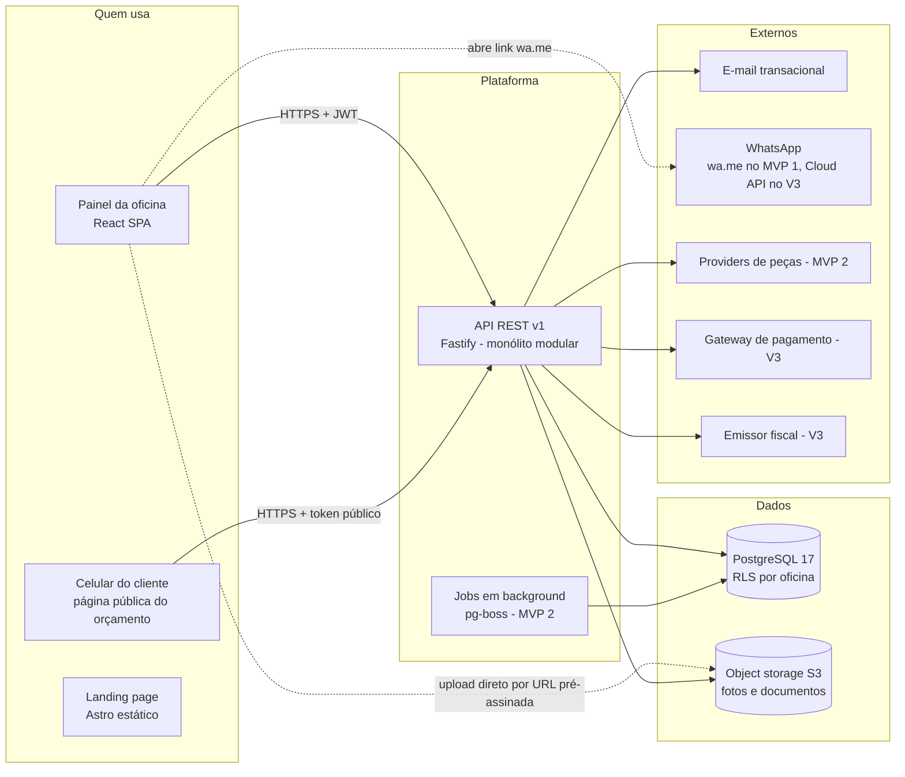
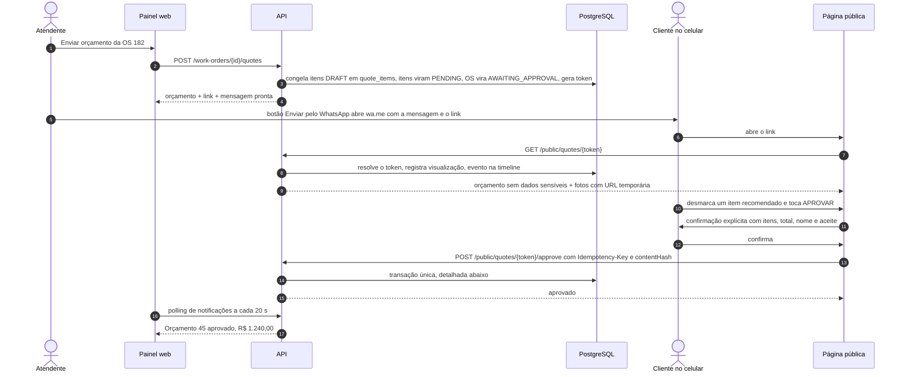
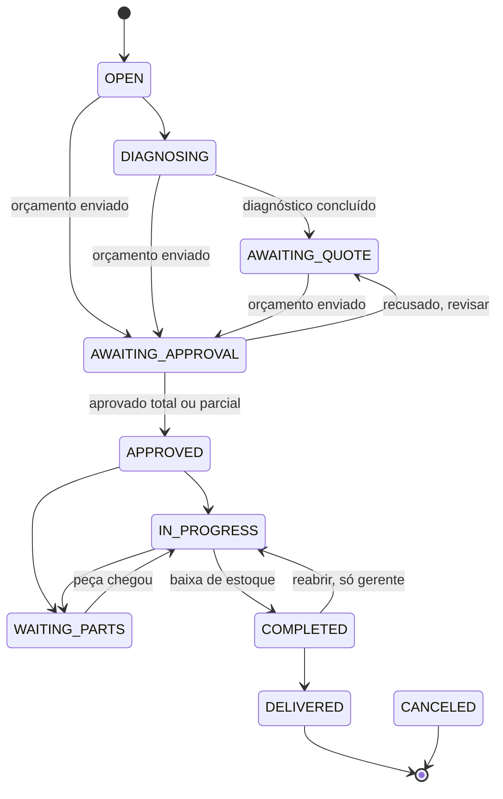

# OficinaOS — Arquitetura

> Fase 0. Documento de decisões. O que está aqui vale até ser trocado
> explicitamente, e cada troca entra na tabela de decisões (§2) com o motivo.

Documentos irmãos: [DATABASE.md](DATABASE.md) (modelo de dados, ERD, RLS) ·
[API.md](API.md) (convenções e endpoints) · [ROADMAP.md](ROADMAP.md) (fases,
integrações, planos).

---

## 1. Visão geral

O OficinaOS é um **monólito modular** multi-tenant: uma API REST, um banco
PostgreSQL com isolamento por oficina **no próprio banco** (RLS), um painel web
(SPA) e uma página pública leve para o cliente aprovar o orçamento pelo celular.



**Por que monólito modular e não microserviços.** O fluxo central (aprovar o
orçamento → mudar a OS → reservar peça → notificar → auditar) precisa ser **uma
transação**. Quebrar isso em serviços traria sagas, filas e consistência eventual
para um problema que o PostgreSQL resolve com `BEGIN … COMMIT`. Os módulos têm
fronteiras claras (cada um dono das suas tabelas, conversando por serviços e
eventos), então extrair um deles no futuro (ex.: pesquisa de peças/marketplace) é
uma refatoração, não uma reescrita.

---

## 2. Decisões técnicas

| # | Decisão | Escolha | Alternativa considerada | Por quê |
|---|---|---|---|---|
| D1 | Estilo | Monólito modular | Microserviços | Transações do fluxo central; equipe pequena; um deploy |
| D2 | Repositório | Monorepo com **npm workspaces**: `apps/api`, `apps/web`, `packages/shared` | pnpm + Turborepo | O npm já está instalado e basta para 3 pacotes. Turborepo entra se o build ficar lento |
| D3 | Framework HTTP | **Fastify 5** | Express 5 | Validação nativa com Zod (`fastify-type-provider-zod`), OpenAPI gerado dos mesmos schemas, encapsulamento de plugins (rotas públicas × autenticadas × por permissão), TypeScript de primeira. É o "framework equivalente" que o briefing permite, e poupa o boilerplate de validação e erro que o Express exigiria |
| D4 | Banco | **PostgreSQL 17** | MySQL | **RLS é decisivo** para multi-tenant seguro. Também `jsonb`, índice parcial, `pg_trgm`, `timestamptz` |
| D5 | Acesso a dados | **Drizzle ORM** + migrations SQL versionadas | Prisma | Com RLS, cada operação roda numa transação com `set_config`. No Drizzle isso é trivial; no Prisma exige *client extensions* envolvendo cada query. As migrations do Drizzle são SQL legível, onde as policies de RLS e os índices parciais moram naturalmente. Sem engine binária |
| D6 | Contratos | **Zod em `packages/shared`**, usado por API e web | Tipos duplicados | Um schema, quatro usos: validação da API, formulário (React Hook Form), tipo TypeScript, documentação OpenAPI. Front e back não divergem |
| D7 | Regras de cálculo | Totais do orçamento, transições de status e custo médio em **`packages/shared`** | Só no backend | O front mostra o total ao vivo com **o mesmo código** que o back usa para decidir. O back sempre recalcula e nunca confia no total enviado pelo cliente |
| D8 | UI | **Tailwind CSS v4 + shadcn/ui (Radix)**, com tokens próprios | MUI, Ant Design, Chakra | O shadcn copia os componentes para dentro do repositório: dá para dar identidade própria sem brigar com o tema de uma biblioteca. Radix garante acessibilidade (foco, teclado, leitor de tela) |
| D9 | Dados no front | TanStack Query + TanStack Table, React Router 7, React Hook Form | Redux, SWR | Cache, revalidação e *optimistic update* prontos; nada de estado global de servidor feito à mão |
| D10 | Autenticação | **Própria**: JWT de acesso curto + refresh token opaco rotativo em cookie httpOnly | Auth0, Clerk, Supabase Auth | Sem custo por usuário ativo, sem lock-in, e o modelo multi-oficina (um usuário em várias oficinas, papel por oficina) é nosso. É uma área sensível, então segue padrões conhecidos (§6) e tem testes dedicados |
| D11 | Senha | **argon2id** (`@node-rs/argon2`, binário pré-compilado) | bcrypt | Recomendação atual (OWASP); o binário pré-compilado roda no Windows sem toolchain C++ |
| D12 | IDs | UUID v7 + número sequencial por oficina | serial global | Ver DATABASE §1 |
| D13 | Dinheiro | Inteiro em centavos | `numeric`/float no JS | Ver DATABASE §1 |
| D14 | Arquivos | Object storage S3-compatível, **upload direto do navegador** com URL pré-assinada; compressão no aparelho antes de subir | Upload passando pela API | A API não trafega bytes de foto; o mecânico no 4G sobe 300 KB em vez de 5 MB |
| D15 | Jobs | **pg-boss** (fila em cima do Postgres), a partir do MVP 2 | Redis + BullMQ | Nenhuma infra nova até precisar. Lembretes e pós-venda não exigem latência de milissegundos |
| D16 | Cache / Redis | **Nenhum no MVP 1** | Redis desde o início | Uma instância da API aguenta centenas de oficinas. Redis entra junto com a segunda instância (rate limit distribuído, pub/sub) |
| D17 | Busca | Postgres `pg_trgm` + `unaccent` | Meilisearch, Elasticsearch | Placa, nome e telefone dentro de uma oficina são poucos milhares de linhas. Motor de busca externo só se a busca de peças do marketplace exigir |
| D18 | Tempo real | Polling de 20 s nas notificações (MVP 1) → **SSE** com `LISTEN/NOTIFY` (MVP 2) | WebSocket | "Orçamento aprovado" chegar em até 20 s resolve o problema. SSE com LISTEN/NOTIFY funciona com várias instâncias sem Redis |
| D19 | PDF | Página de impressão com CSS de impressão (MVP 1) → PDF no servidor com Chromium headless (MVP 2) | Biblioteca de PDF desenhada à mão | O mesmo componente do orçamento vira tela, impressão e PDF. Um layout só |
| D20 | Agenda | **react-big-calendar** (MIT) estilizado, com visão por mecânico e arrastar e soltar | FullCalendar | No FullCalendar, as visões **por recurso** (coluna por mecânico) são pagas. Se a customização do react-big-calendar ficar cara, a visão de dia/semana vira componente próprio |
| D21 | Landing page | **Astro** (HTML estático) em `apps/landing` | Mesma SPA React | **Única troca de stack proposta.** A landing precisa de SEO e de carregar instantaneamente; uma SPA entrega um HTML vazio ao Google. O Astro aceita componentes React, então os blocos visuais são reaproveitados |
| D22 | Idioma no código | Entidades, colunas e valores de enum **em inglês**; rótulos e URLs do painel **em pt-BR** | Tudo em português | Consistência com o ecossistema (bibliotecas, logs, erros). O mapa `status → rótulo` fica em `packages/shared/enums` |
| D23 | Testes | Vitest + `fastify.inject` + **Postgres real** de teste; Playwright para o fluxo ponta a ponta | Mock de banco | RLS, lock e constraint só se testam num banco de verdade |
| D24 | Hospedagem (quando for ao ar) | Região **São Paulo** (banco, API e storage) | EUA | Latência para o usuário e conforto regulatório (LGPD). Decisão de fornecedor fica para o fim do MVP 1 |

---

## 3. Estrutura de pastas

```text
oficinaos/
├── apps/
│   ├── api/                              # Fastify + Drizzle
│   │   ├── src/
│   │   │   ├── server.ts                 # bootstrap (listen)
│   │   │   ├── app.ts                    # monta plugins e módulos; testável com inject()
│   │   │   ├── config/env.ts             # variáveis validadas com Zod: o boot falha se faltar algo
│   │   │   ├── db/
│   │   │   │   ├── client.ts             # pool conectado como oficinaos_app (sem BYPASSRLS)
│   │   │   │   ├── tenant.ts             # withTenant(ctx, fn): transação + set_config
│   │   │   │   ├── schema/               # tabelas Drizzle, um arquivo por domínio
│   │   │   │   ├── migrations/           # SQL versionado (tabelas, RLS, policies, índices)
│   │   │   │   └── seed/                 # plans, defaults por oficina, demo
│   │   │   ├── core/
│   │   │   │   ├── errors.ts             # AppError → problem+json
│   │   │   │   ├── plugins/              # auth, tenant, rbac, entitlements, rate-limit, request-id, security headers
│   │   │   │   ├── events.ts             # event bus em processo, disparado após o COMMIT
│   │   │   │   ├── audit.ts              # audit.record(tx, {...})
│   │   │   │   └── http.ts               # paginação, idempotência, helpers
│   │   │   ├── modules/                  # um diretório por domínio, sempre o mesmo formato:
│   │   │   │   ├── work-orders/
│   │   │   │   │   ├── work-orders.routes.ts       # HTTP: schema, permissão, chama o service
│   │   │   │   │   ├── work-orders.service.ts      # regras de negócio e transações
│   │   │   │   │   ├── work-orders.repository.ts   # queries Drizzle (nada de SQL fora daqui)
│   │   │   │   │   ├── work-orders.events.ts       # eventos emitidos e consumidos
│   │   │   │   │   └── work-orders.test.ts
│   │   │   │   ├── auth/  organizations/  members/  customers/  vehicles/
│   │   │   │   ├── appointments/  quotes/  public/  catalog/  inventory/
│   │   │   │   ├── payments/  messaging/  notifications/  uploads/
│   │   │   │   └── search/  dashboard/  audit/  billing/
│   │   │   └── integrations/             # tudo que fala com o mundo lá fora, atrás de uma interface
│   │   │       ├── storage/              # StorageProvider: s3.ts, local-disk.ts (dev)
│   │   │       ├── email/                # EmailProvider: smtp.ts, console.ts (dev)
│   │   │       ├── messaging/            # MessagingProvider: whatsapp-link.ts (V1), whatsapp-cloud.ts (V3)
│   │   │       ├── parts-search/         # PartSearchProvider: internal-inventory.ts, mock.ts, ... (MVP 2)
│   │   │       ├── payments/             # PaymentProvider: manual.ts (V1), gateway (V3)
│   │   │       ├── address/              # CEP e CNPJ (dados públicos)
│   │   │       ├── vehicle-data/         # VehicleDataProvider (V3)
│   │   │       └── fiscal/               # FiscalProvider (V3)
│   │   ├── scripts/                      # db-setup.ts (roles, bancos, extensões), migrate.ts
│   │   └── test/                         # setup do banco de teste, factories, helper de 2 oficinas
│   ├── web/                              # React + Vite
│   │   └── src/
│   │       ├── main.tsx
│   │       ├── app/                      # router, providers, layouts (AppShell, AuthLayout)
│   │       ├── components/
│   │       │   ├── ui/                   # primitivos shadcn/Radix com os tokens do OficinaOS
│   │       │   └── …                     # DataTable, PageHeader, PlateBadge, MoneyInput, StatusBadge,
│   │       │                             # EmptyState, CommandMenu (⌘K), ConfirmDialog
│   │       ├── features/                 # espelha os módulos da API
│   │       │   └── work-orders/
│   │       │       ├── api.ts            # hooks TanStack Query (useWorkOrder, useAddItem…)
│   │       │       ├── pages/            # lista, detalhe, assistente "Nova OS"
│   │       │       └── components/
│   │       ├── public/                   # /orcamento/:token: chunk separado, mobile-first
│   │       ├── lib/                      # api-client (refresh single-flight), format (moeda, data, placa, fone), whatsapp
│   │       └── styles/                   # tokens (CSS variables), claro e escuro
│   └── landing/                          # Astro (MVP 2)
├── packages/
│   └── shared/                           # @oficinaos/shared
│       └── src/
│           ├── schemas/                  # Zod: contratos da API
│           ├── enums/                    # status + rótulos pt-BR + cores semânticas
│           ├── permissions.ts            # permissões e matriz por papel
│           ├── state-machines/           # transições válidas: OS, orçamento, agendamento, compra
│           ├── pricing.ts                # cálculo de totais (fonte única front/back)
│           ├── inventory.ts              # custo médio, disponível
│           ├── entitlements.ts           # plano → recursos e limites
│           └── br/                       # CPF/CNPJ, placa (antiga ↔ Mercosul), telefone, CEP
├── e2e/                                  # Playwright: fluxo orçamento → aprovação
├── docker/postgres/init.sql              # roles owner/app, extensões
├── docker-compose.yml                    # postgres, minio, mailpit
├── docs/                                 # este documento e os irmãos
├── .env.example
├── package.json                          # workspaces + scripts da raiz
└── tsconfig.base.json
```

**Regra de dependência:** `routes → service → repository`. As rotas não tocam no
banco; os repositories não tomam decisões de negócio; um módulo não importa o
repository de outro (usa o service dele). `packages/shared` não importa nada de
`apps/`.

---

## 4. Ciclo de vida de uma requisição

```text
HTTP
 → request-id + log estruturado (pino)
 → rate limit (por IP; por usuário depois do auth)
 → auth: valida o JWT de acesso → { userId, orgId, sessionId }
 → tenant: carrega o membership (papel, ativo) com cache de 30 s; sessão revogada → 401
 → rbac: a rota declara a permissão, ex. requirePermission('work_orders:write')
 → entitlements: a rota declara o recurso do plano, se houver, ex. requireFeature('parts_search')
 → validação Zod de params, query e body (400 com os campos)
 → handler → service
     → withTenant({ orgId, userId }, async tx => {
          set_config('app.org_id', orgId, true)
          regras de negócio + repositories
          audit.record(tx, …)   timeline.add(tx, …)
       })                                 ← COMMIT
     → eventos após o commit (notificações, e no MVP 2 jobs)
 → resposta; AppError → problem+json
```

O papel **não vai dentro do JWT**. Ele é lido do banco (com cache curto) a cada
requisição. Rebaixar ou desativar um funcionário vale em até 30 segundos, e não
quando o token dele expirar.

---

## 5. Estratégia multi-tenant

**Modelo: banco único, schema único, `organization_id` em toda tabela de tenant.**

| Opção | Veredito |
|---|---|
| Banco por oficina | Custo e operação inviáveis para milhares de oficinas pequenas |
| Schema por oficina | Migration rodando em milhares de schemas; pool de conexões explode |
| **Schema compartilhado + RLS** | Padrão de SaaS para PMEs. Barato, uma migration, e o isolamento é garantido pelo banco |

**Quatro camadas de defesa (qualquer uma sozinha já barraria um vazamento):**

1. **Contexto só do token.** O `organization_id` vem do JWT validado, **nunca** do
   body, da URL ou de um header. Não existe `?orgId=`.
2. **Repositories exigem o contexto.** Toda função de repository recebe o `tx` que
   saiu de `withTenant`. Não existe acesso ao banco "solto" nos módulos de tenant.
3. **RLS no PostgreSQL** (DATABASE §2). Se um `WHERE organization_id` for esquecido,
   o banco filtra mesmo assim. Sem contexto definido, não retorna nada.
4. **FK compostas** `(organization_id, id)` (DATABASE §1.2). Uma referência cruzada
   entre oficinas é impossível no nível do banco.

**Recurso de outra oficina responde 404, nunca 403**, para não revelar que o ID existe.

**Testes obrigatórios de isolamento** (`test/tenant-isolation.test.ts`): cria as
oficinas A e B e, para cada recurso, verifica que o usuário de A recebe 404 ao
ler, editar, apagar ou referenciar (ex.: criar uma OS de A com o veículo de B) algo
de B. Mais o teste de guarda do CI, que falha se alguma tabela de tenant estiver
sem RLS.

**Backoffice da plataforma** (MVP 2): `users.is_platform_admin` acessa uma área
separada, `/api/v1/platform/*`, para suporte (ver oficinas, suspender, entrar como
a oficina). "Entrar como" define o contexto de tenant explicitamente, é registrado
na auditoria **da própria oficina** e mostra uma faixa na tela.

---

## 6. Autenticação e sessão

| Peça | Como funciona |
|---|---|
| **Access token** | JWT HS256, validade de **15 min**. Claims: `sub` (usuário), `org` (oficina ativa), `sid` (sessão). Sem nome, e-mail nem papel. Fica **só em memória** no front (nunca em `localStorage`, que qualquer XSS lê) |
| **Refresh token** | 256 bits aleatórios, opaco. Vai em cookie `httpOnly; Secure; SameSite=Strict; Path=/api/v1/auth`. O banco guarda **só o hash SHA-256**. Validade de 30 dias, deslizante |
| **Rotação** | Cada `/auth/refresh` troca o refresh token. Se o token **anterior** reaparecer fora da janela de tolerância, alguém o roubou: a sessão inteira é revogada |
| **Janela de tolerância** | 30 s para o token anterior (duas abas renovando juntas). No front, a renovação é *single-flight* e coordenada entre abas com a Web Locks API (`navigator.locks`), para não gerar falso alarme de roubo |
| **Recarregar a página** | O front chama `/auth/refresh` no boot; o cookie traz a sessão de volta |
| **CSRF** | O cookie só vai para `/api/v1/auth/*` com `SameSite=Strict`; o refresh também confere o header `Origin`. As outras rotas usam `Authorization: Bearer`, imune a CSRF |
| **Controle de sessões** | O usuário vê as sessões (aparelho, IP, último uso) e encerra qualquer uma. Trocar a senha encerra todas as outras. Desativar um membership encerra as sessões naquela oficina |
| **Várias oficinas** | Um usuário pode ter membership em várias oficinas (consultor, dono de duas unidades). `POST /auth/switch-organization` emite tokens para a outra oficina |
| **Senha** | argon2id; mínimo de 8 caracteres e checagem contra lista de senhas comuns (orientação NIST 800-63B). Sem "precisa de símbolo" |
| **Recuperação** | Token aleatório de 30 min, uso único, só o hash é gravado. Resposta **idêntica** exista ou não o e-mail (não revela quem tem conta). Usar o token encerra todas as sessões |
| **Força bruta** | Rate limit no login por IP e por e-mail (5/min), com atraso crescente; sem bloqueio definitivo de conta (que viraria arma para travar o dono da oficina) |
| **Convite** | O OWNER/ADMIN convida por e-mail com papel; o link cria a conta ou vincula uma existente |
| **Verificação de e-mail** | Enviada no cadastro; não bloqueia o uso (ativação primeiro). Passa a ser obrigatória para ações sensíveis (trocar e-mail, cobrança) |

Segredos (`JWT_SECRET`, credenciais do banco e do storage) ficam só em variáveis
de ambiente da API. **O front não recebe segredo nenhum**; as variáveis `VITE_*`
são públicas por definição e só levam URLs.

---

## 7. Papéis e permissões (RBAC)

As permissões são constantes em `packages/shared/permissions.ts`. A API usa para
barrar; o front usa **a mesma matriz** para esconder menus e botões (o front esconde,
quem garante é a API).

| Permissão | OWNER | ADMIN | MANAGER | ATTENDANT | MECHANIC | FINANCE |
|---|:-:|:-:|:-:|:-:|:-:|:-:|
| `dashboard:view` (operacional) | ✓ | ✓ | ✓ | ✓ | ✓ | ✓ |
| `dashboard:view_financial` (faturamento, ticket, margem) | ✓ | ✓ | ✓ | — | — | ✓ |
| `customers:read` | ✓ | ✓ | ✓ | ✓ | ✓ ¹ | ✓ |
| `customers:write` / `vehicles:write` | ✓ | ✓ | ✓ | ✓ | — ² | — |
| `customers:delete` / `vehicles:delete` | ✓ | ✓ | ✓ | — | — | — |
| `appointments:read` | ✓ | ✓ | ✓ | ✓ | ✓ ³ | — |
| `appointments:write` | ✓ | ✓ | ✓ | ✓ | — | — |
| `work_orders:read` | ✓ | ✓ | ✓ | ✓ | ✓ | ✓ |
| `work_orders:write` (itens, diagnóstico, fotos, check-in) | ✓ | ✓ | ✓ | ✓ | ✓ | — |
| `work_orders:change_status` | ✓ | ✓ | ✓ | ✓ | ✓ ⁴ | — |
| `work_orders:cancel` / `work_orders:reopen` | ✓ | ✓ | ✓ | — | — | — |
| `work_orders:discount` (até o limite do papel) | ✓ | ✓ | ✓ | ✓ | — | — |
| `work_orders:discount_unlimited` | ✓ | ✓ | ✓ | — | — | — |
| `work_orders:edit_approved` (mexer em item já aprovado) | ✓ | ✓ | ✓ | — | — | — |
| `quotes:send` | ✓ | ✓ | ✓ | ✓ | — | — |
| `quotes:record_manual_approval` (telefone/presencial) | ✓ | ✓ | ✓ | ✓ | — | — |
| `catalog:read` | ✓ | ✓ | ✓ | ✓ | ✓ | ✓ |
| `catalog:write` (serviços, peças, preços) | ✓ | ✓ | ✓ | — | — | — |
| `parts:view_cost` (custo e margem) | ✓ | ✓ | ✓ | — | — | ✓ |
| `inventory:read` | ✓ | ✓ | ✓ | ✓ | ✓ | ✓ |
| `inventory:adjust` (entrada, ajuste, devolução) | ✓ | ✓ | ✓ | — | — | — |
| `payments:record` | ✓ | ✓ | ✓ | ✓ ⁵ | — | ✓ |
| `payments:cancel` | ✓ | ✓ | — | — | — | ✓ |
| `finance:read` / `finance:write` (MVP 2) | ✓ | ✓ | leitura | — | — | ✓ |
| `reports:read` | ✓ | ✓ | ✓ | — | — | ✓ |
| `team:manage` | ✓ | ✓ | — | — | — | — |
| `organization:manage` (dados, logo, templates, checklist) | ✓ | ✓ | — | — | — | — |
| `audit:read` | ✓ | ✓ | — | — | — | — |
| `billing:manage` | ✓ | — | — | — | — | — |

1. O mecânico vê nome e veículo; telefone, CPF e endereço vêm mascarados.
2. O mecânico atualiza a quilometragem no check-in, que é parte da OS.
3. O mecânico vê a própria agenda.
4. O mecânico pode: iniciar diagnóstico, iniciar execução, marcar aguardando peça
   e finalizar. Não pode entregar nem cancelar.
5. O atendente costuma ser o caixa da oficina pequena: **registra** o pagamento na
   entrega, mas não acessa o módulo financeiro.

O **limite de desconto por papel** é configuração da oficina (ex.: atendente até
10%). Acima dele, a API responde 403 com código `DISCOUNT_ABOVE_LIMIT`, e a UI diz
"peça a um gerente". O pedido de aprovação de desconto no próprio sistema é MVP 2.

Papéis customizados por oficina (plano Business, V3) serão um conjunto de
permissões salvo no banco; os guards não mudam, porque já verificam permissões e
não papéis.

---

## 8. Fluxos principais

### 8.1 O fluxo que precisa ser excepcional: orçamento → link → cliente → aprovação → OS



**O que acontece na transação da aprovação:**

1. `SELECT … FOR UPDATE` no orçamento.
2. Valida: status `SENT`, dentro da validade, `contentHash` igual ao do servidor (o
   cliente aprovou **esta** versão) e os itens obrigatórios presentes.
3. Grava `quote_approvals` (decisão, itens, total, nome digitado, IP, user agent, hash).
4. Itens do orçamento aprovados → `APPROVED`; desmarcados → `REJECTED`.
5. OS → `APPROVED`, com `approved_total_cents` recalculado pelo `pricing.ts`.
6. Reserva o estoque das peças aprovadas (§10).
7. Timeline, auditoria (`actor_type = CUSTOMER`) e notificação para atendente,
   gerente e dono.

Se o orçamento tiver mudado nesse meio-tempo, a resposta é **409** e a página
mostra a versão nova. Um segundo toque em "Aprovar" devolve a mesma resposta
(idempotência), sem aprovar duas vezes.

**Aprovação sem link.** Muito cliente responde "pode fazer" no WhatsApp ou por
telefone. O atendente registra a aprovação manual (canal, itens, observação); a
auditoria grava **quem** registrou. Há também a **aprovação presencial em um
toque** (gera o orçamento e registra a aprovação juntos) para o serviço rápido de
balcão.

**Valor jurídico, sem exagero.** A aprovação pelo link é uma **assinatura eletrônica
simples** (Lei 14.063/2020): data e hora, IP, aparelho, nome digitado, aceite
explícito e hash do conteúdo aprovado. Serve como prova de que o cliente autorizou
aquele serviço por aquele valor, que é o que resolve a discussão na hora da
entrega. Não equivale a certificado ICP-Brasil, e a interface não promete isso.

### 8.2 Página pública do orçamento

- Mobile-first, **chunk JavaScript separado** do painel (meta: menos de 100 KB de JS
  comprimido), rápida em 3G e em celular de entrada.
- Cabeçalho com logo, nome e telefone da oficina. Título **"Orçamento para seu
  veículo"**, placa no estilo Mercosul, modelo e ano.
- Itens agrupados em **Necessários** e **Recomendados** (os recomendados podem ser
  desmarcados; o total se atualiza na hora).
- Fotos junto do item: **"Identificamos este problema no seu veículo."**
- Barra inferior fixa: total, **[APROVAR ORÇAMENTO]**, **[RECUSAR]**, **[FAZER PERGUNTA]**.
- A confirmação é um *bottom sheet*: resumo ("Você está aprovando 3 itens, total de
  R$ 1.240,00"), nome, caixa de aceite ("Autorizo a execução dos serviços
  descritos") e o botão final.
- Estados: aprovado, recusado, expirado ("peça um novo orçamento à oficina", com
  botão de WhatsApp), substituído (vai para a versão atual) e revogado.
- Não mostra CPF, endereço nem custo das peças. `noindex`, sem cookies de
  terceiros e sem analytics de terceiros.
- "Fazer pergunta" grava a mensagem, notifica a oficina e oferece falar pelo
  WhatsApp. O chat dentro da página é MVP 2.

### 8.3 Estados da OS



| Código | Rótulo na UI |
|---|---|
| `OPEN` | Aberta |
| `DIAGNOSING` | Em diagnóstico |
| `AWAITING_QUOTE` | Aguardando orçamento |
| `AWAITING_APPROVAL` | Aguardando aprovação |
| `APPROVED` | Aprovada |
| `IN_PROGRESS` | Em execução |
| `WAITING_PARTS` | Aguardando peça |
| `COMPLETED` | Finalizada |
| `DELIVERED` | Entregue |
| `CANCELED` | Cancelada |

- `CANCELED` é alcançável de qualquer estado antes de `DELIVERED` (fora do diagrama
  para não poluir), exige motivo e libera as reservas de estoque.
- As transições automáticas (enviar orçamento, aprovar, recusar) são feitas pelo
  sistema; as outras são ações com permissão (§7). A tabela de transições mora em
  `packages/shared/state-machines` e é testada.
- **O orçamento complementar não muda o status da OS.** O carro continua
  `IN_PROGRESS` nos itens já aprovados, e a OS mostra o selo "complementar aguardando
  aprovação".
- **Pagamento é independente do status**: `payment_status` (a pagar, parcial, pago).
  Entregar com saldo em aberto é permitido (o "fiado" existe), mas pede
  confirmação e aparece em "Atenção necessária".

### 8.4 "Nova OS" com o mínimo de cliques

Um assistente numa tela só, com etapas que se abrem na sequência, sem trocar de página:

1. **Cliente:** um campo que busca por placa, nome ou telefone. Digitou uma placa
   que existe, cliente e veículo já vêm preenchidos (pula a etapa 2). Não achou, cria
   ali mesmo com o mínimo: nome e WhatsApp.
2. **Veículo:** os carros do cliente em cartões, ou "novo" com placa, marca, modelo e ano.
3. **Problema:** relato do cliente (texto livre, com ditado por voz do próprio
   teclado do celular) e quilometragem.
4. **Serviços e peças:** busca no catálogo com preço automático; item avulso em uma linha.
5. **Revisão:** totais, desconto, itens recomendados, fotos.
6. **Enviar:** WhatsApp, copiar link ou imprimir. Ou **salvar como aberta** e
   orçar depois do diagnóstico.

Atalhos: `N` abre a Nova OS em qualquer tela, `⌘K`/`Ctrl+K` abre a busca global.

---

## 9. Cálculo do orçamento (`packages/shared/pricing.ts`)

```text
bruto_da_linha    = arredonda( quantidade_em_milésimos × preço_unitário_centavos / 1000 )
total_da_linha    = bruto_da_linha − desconto_da_linha         (nunca negativo)
subtotal          = Σ total_da_linha                           (peças e serviços separados)
desconto_geral    = PERCENT ? arredonda(subtotal × bps / 10000) : valor   (limitado ao subtotal)
total             = subtotal − desconto_geral + acréscimo
```

- Arredondamento **meio para cima** (o comercial), na linha, antes de somar. O total
  impresso sempre bate com a soma das linhas impressas.
- **Aprovação parcial:** desconto percentual se aplica ao que foi aprovado;
  desconto em **valor** é **proporcional** à fração aprovada do subtotal, e a página
  pública mostra o total recalculado antes da confirmação. Ninguém é surpreendido.
- Serviço com `pricing_mode = HOURLY`: preço = hora técnica da oficina × tempo
  padrão (editável na linha).
- Preço sugerido de peça = custo × (1 + margem). A margem vem da peça, senão da
  oficina. O valor é sempre editável.
- A API **recalcula tudo** a cada gravação e ignora totais enviados pelo front.
- A suíte de testes cobre: quantidade fracionada, desconto maior que o subtotal,
  aprovação parcial com os dois tipos de desconto, arredondamento de centavo e item
  de valor zero (cortesia).

---

## 10. Estoque: reserva e baixa

| Momento | Efeito |
|---|---|
| Peça entra na OS (rascunho ou pendente) | Nenhum. A tela mostra o disponível (`em estoque − reservado`) e avisa **"Peça não disponível"** |
| Item aprovado, origem `STOCK` | **Reserva** `min(quantidade, disponível)` → `RESERVED` ou `PARTIAL`. Faltou peça? A OS ganha o alerta, o botão **[Pesquisar fornecedores]** (MVP 2) e sugere `WAITING_PARTS` |
| Origem `CUSTOMER_PROVIDED` (peça do cliente) ou `TO_ORDER` | Não mexe no estoque. `TO_ORDER` vira sugestão de compra no MVP 2 |
| OS finalizada (`COMPLETED`) | **Baixa**: movimento `WORK_ORDER_OUT` da quantidade inteira, consome a reserva e atualiza o saldo |
| OS cancelada / item removido antes da baixa | Libera a reserva (`RELEASED`) |
| Item removido depois da baixa | Movimento de devolução (`CUSTOMER_RETURN`) |
| Entrada manual ou compra | `MANUAL_IN`/`PURCHASE_IN` com custo; recalcula o custo médio móvel |

**Estoque insuficiente na baixa não trava a finalização.** Oficina pequena raramente
tem o estoque do sistema 100% certo, e travar a entrega do carro por isso faria o
dono abandonar o sistema. Por padrão (configurável), a baixa acontece, o saldo fica
negativo, a auditoria registra, e "Atenção necessária" mostra "3 peças com estoque
negativo: ajuste necessário". A regra de ouro do briefing (resolver o problema real
antes do bonito) decide aqui.

Todas as alterações de saldo usam `SELECT … FOR UPDATE` nas peças em ordem de ID,
dentro da transação da operação.

---

## 11. Fotos e arquivos

1. O front **comprime no aparelho** (lado maior de 1600 px, JPEG/WebP ~80%) e gera
   a miniatura. Uma foto de celular de 4 a 6 MB vira ~300 KB.
2. `POST /uploads` → a API valida tipo, tamanho e cota do plano, cria o
   `attachment` como `PENDING_UPLOAD` e devolve uma URL pré-assinada de PUT (5 min).
3. O navegador envia **direto para o storage**, com retry; a fila de envio sobrevive
   à perda de sinal enquanto a aba estiver aberta.
4. `POST /uploads/{id}/complete` → a API confere o objeto (tamanho e tipo) e marca
   `READY`.
5. Leitura: bucket **privado**, URL pré-assinada de GET com validade curta. A página
   pública só recebe URL das fotos com `visible_to_customer = true` daquele orçamento.

Vídeo: aceito a partir do MVP 2, com limite de tamanho por plano. Em dev, o
`StorageProvider` pode gravar em disco local, sem MinIO.

---

## 12. Integrações: interfaces e mocks

Tudo que depende de terceiros fica atrás de uma interface em
`apps/api/src/integrations`. O domínio conhece a interface, nunca o fornecedor.
Quando não houver integração real, existe um **mock declarado como mock**: o nome
tem `Mock`, os dados trazem `isMock: true` e a interface mostra um selo
"DADOS DE DEMONSTRAÇÃO".

```ts
// pesquisa de peças (MVP 2)
interface PartSearchProvider {
  readonly id: string;                    // 'internal-inventory' | 'supplier-rfq' | 'mercado-livre' | 'mock'
  readonly isMock: boolean;
  readonly capabilities: { price: boolean; shipping: boolean; stock: boolean; fitment: boolean };
  searchParts(query: PartQuery, vehicle?: VehicleRef, signal?: AbortSignal): Promise<PartOffer[]>;
}

// pagamentos (V3; no MVP 1 existe só o ManualPaymentProvider, que registra o que já foi pago)
interface PaymentProvider {
  createCharge(input: { amountCents: number; method: 'PIX' | 'CARD' | 'BOLETO'; customer: PayerRef;
                        reference: string; idempotencyKey: string }): Promise<Charge>;
  getCharge(providerId: string): Promise<Charge>;
  refund(providerId: string, amountCents?: number): Promise<Refund>;
  parseWebhook(headers: Headers, rawBody: string): Promise<PaymentEvent>;   // valida a assinatura
}

// mensagens (V1: gera o link wa.me; V3: WhatsApp Business Platform oficial)
interface MessagingProvider {
  readonly delivery: 'user-assisted' | 'api';
  send(input: { to: string; templateKey: string; variables: Record<string, string>;
                body: string }): Promise<{ status: 'LINK_READY' | 'SENT' | 'FAILED'; url?: string }>;
}

interface StorageProvider  { presignPut(...): Promise<PresignedUrl>; presignGet(...): Promise<string>; head(key: string): Promise<ObjectInfo> }
interface EmailProvider    { send(msg: EmailMessage): Promise<void> }
interface VehicleDataProvider { lookupByPlate(plate: string): Promise<VehicleInfo | null> }   // V3, só fonte licenciada
interface FiscalProvider   { issueServiceInvoice(...): Promise<FiscalDocument>; issueProductInvoice(...): Promise<FiscalDocument> }   // V3
```

A pesquisa de peças consulta os providers **em paralelo**, com timeout por provider;
um provider lento ou fora do ar não derruba a busca, só aparece como "indisponível
agora". Os resultados são gravados com `fetched_at` (preço é sempre "consultado às 14:32").

**Pontos de extensão para IA (V3), sem a V1 depender deles.** Os eventos de domínio
(`quote.approved`, `work_order.completed`…) e os dados que já guardamos
(`odometer_readings`, `services.interval_km`, histórico de preços) são a matéria-prima.
A IA entra como **provider opcional** atrás de interfaces (`DiagnosisAssistant`,
`MessageComposer`, `DemandForecaster`) e sempre como **sugestão** que uma pessoa
aceita. Com a IA desligada, a tela simplesmente não mostra a sugestão.

---

## 13. Front-end e design

### 13.1 Rotas

| Área | Rotas |
|---|---|
| Autenticação | `/entrar`, `/criar-conta`, `/esqueci-senha`, `/redefinir-senha/:token`, `/convite/:token` |
| Painel | `/` (dashboard), `/ordens`, `/ordens/nova`, `/ordens/:numero`, `/clientes`, `/clientes/:id`, `/veiculos`, `/veiculos/:id`, `/agenda`, `/catalogo/servicos`, `/catalogo/pecas`, `/estoque`, `/atividades`, `/configuracoes/*` |
| Público | `/orcamento/:token` (MVP 1), `/avaliacao/:token` e `/cotacao/:token` para fornecedor (MVP 2) |

A OS usa o **número** na URL (`/ordens/182`), que é o que a equipe fala e digita.

### 13.2 Identidade visual

- **Base neutra grafite** (cinzas levemente quentes) com um **acento laranja de
  sinalização** (faixa de `#F26B1D`, a validar em contraste), usado com
  parcimônia: botão principal, foco, o **+ Nova OS**. Status usam cores semânticas
  próprias (âmbar aguardando, azul em execução, verde finalizada), nunca o acento.
- Tipografia: Inter (ou Geist) com **números tabulares** em valores e tabelas; mono
  para placa e códigos de peça.
- **PlateBadge**: a placa desenhada como placa Mercosul (faixa azul, fonte de placa).
  O olho acha o carro na lista antes de ler.
- Densidade de ERP moderno (Linear, Stripe): tabela compacta, grid de 8 px, sidebar
  recolhível, breadcrumbs, drawer para editar sem perder a lista, toasts, skeletons,
  estados vazios que ensinam o próximo passo e confirmação antes de toda ação destrutiva.
- **Modo escuro** por CSS variables (custo baixo com os tokens) e respeitando o
  sistema. A página pública do orçamento é sempre clara: é um documento.
- **Celular**: a sidebar vira drawer, tabelas viram cartões e o mecânico tem a
  visão **"Minhas OS"**, com botões grandes para foto, check-in e mudança de status.
- **Acessibilidade**: foco visível, navegação por teclado (Radix), contraste AA e
  alvos de toque de 44 px.

### 13.3 Dados

- TanStack Query com chaves por recurso; **paginação e filtros no servidor**; nada
  de baixar a lista inteira.
- *Optimistic update* nos itens da OS (adicionar ou remover peça fica instantâneo).
- Rotas carregadas sob demanda (`lazy`); a página pública é um chunk isolado.
- O cliente HTTP renova o token automaticamente (single-flight) e trata o 409 de
  versão com "Esta OS foi alterada por outra pessoa. Recarregar?".

---

## 14. Segurança: checklist

| Item | Como |
|---|---|
| Senha | argon2id |
| Tokens | JWT de 15 min + refresh rotativo com detecção de reuso (§6) |
| Validação | Zod em toda entrada (params, query, body); tamanho máximo de body |
| SQL injection | Só queries parametrizadas (Drizzle); SQL cru apenas com template `sql` parametrizado |
| XSS | React escapa por padrão; nada de `dangerouslySetInnerHTML` com dado do usuário; CSP restritiva |
| Headers | `@fastify/helmet`: HSTS, CSP, `X-Content-Type-Options`, `Referrer-Policy` (o token do orçamento não vaza por Referer) |
| CORS | Lista explícita de origens por ambiente; credenciais só para a origem do painel |
| Rate limit | Login, recuperação e convite (estritos); rotas públicas por IP; rotas autenticadas por usuário |
| Tenant | 4 camadas (§5) + testes |
| RBAC | Guard por rota + testes por papel |
| Link público | 256 bits de entropia, expira, pode ser revogado, rate limit, sem dados sensíveis |
| Uploads | Tipo e tamanho validados no presign e conferidos no complete; bucket privado |
| Auditoria | `activity_logs` append-only (sem UPDATE/DELETE para a role da aplicação) |
| Logs | pino estruturado, **sem** senha, token, CPF completo ou corpo de requisição sensível (redação automática) |
| Segredos | Só em variáveis de ambiente da API; `.env` fora do git; `.env.example` sem valores reais |
| Dependências | `npm audit` no CI; lockfile versionado |
| LGPD | Oficina = controladora, OficinaOS = operadora (termo de uso e acordo de tratamento de dados); exportação dos dados do cliente; anonimização sob pedido (preserva OS e valores, remove os dados pessoais); opt-in para mensagens de pós-venda; IP guardado só na aprovação, com finalidade de prova |

---

## 15. Performance

- Toda listagem paginada no servidor (máximo de 100 por página); filtros e ordenação no SQL.
- Índices começando por `organization_id`, desenhados para as consultas reais (DATABASE §7).
- Detalhe da OS em **uma** chamada que traz o agregado (OS + itens + resumo),
  sem N+1; timeline e fotos em chamadas separadas, carregadas sob demanda.
- Dashboard: agregações no SQL com cache de 60 s por oficina (em memória no MVP 1).
- Busca global: no máximo 5 resultados por tipo, com `LIMIT` em cada consulta.
- Front: code splitting por rota, imagens comprimidas no upload, miniaturas nas listas.
- Metas iniciais: p95 da API abaixo de 200 ms nas rotas de leitura; página pública
  interativa em menos de 2 s em 4G.

---

## 16. Observabilidade e operação

- Logs pino em JSON com `requestId`, `orgId` e `userId` em toda linha.
- Sentry (erros de front e back) a partir do primeiro deploy.
- `/health` (processo) e `/ready` (banco) para o orquestrador.
- Backups do Postgres com recuperação para um ponto no tempo, e **restauração
  testada** antes de ter cliente pagante.
- Migrations rodam no deploy como `oficinaos_owner`; a API roda como `oficinaos_app`.
- Ambientes: `development`, `test` (CI), `staging` (dados demo) e `production`.

---

## 17. Ambiente de desenvolvimento

**Decisão (10/09/2026): PostgreSQL 17 nativo** no lugar do Docker. API e web
rodam no host com hot reload. O único serviço externo exigido em dev é o Postgres:

| Necessidade | Em desenvolvimento | Em produção |
|---|---|---|
| Banco | PostgreSQL 17 instalado no Windows (serviço `postgresql-x64-17`) | Postgres gerenciado |
| Arquivos | `STORAGE_DRIVER=local` (grava em `storage/`) | S3/R2 |
| E-mail | `EMAIL_DRIVER=console` (o e-mail aparece no terminal da API) | SES/Resend |

`npm run db:setup` cria as roles `oficinaos_owner` e `oficinaos_app`, os bancos
`oficinaos_dev` e `oficinaos_test` (UTF-8, ordenação ICU pt-BR), as extensões e os
privilégios padrão. É idempotente. Um `docker-compose.yml` fica para quando houver
alguém no time com Docker; não é versionado sem ter sido testado.

Os comandos estão no README.

---

## 18. Estratégia de testes

| Camada | Ferramenta | O que cobre |
|---|---|---|
| Regras puras (`packages/shared`) | Vitest | Cálculo de orçamento, transições de status, custo médio, CPF/CNPJ, placa antiga ↔ Mercosul, telefone |
| API (integração) | Vitest + `fastify.inject` + Postgres de teste | Autenticação (login, refresh, reuso de token, reset), **isolamento entre oficinas**, permissões por papel, criação de OS, aprovação (total, parcial, dupla, versão velha, expirada), reserva e baixa de estoque, pagamento, auditoria |
| Guarda do schema | Vitest | Toda tabela com `organization_id` tem RLS; a role da aplicação não tem BYPASSRLS |
| Ponta a ponta | Playwright | Os 11 passos do fluxo prioritário, incluindo a aprovação num viewport de celular |

Cada etapa só termina com `typecheck`, `lint`, testes e `build` passando, e com o
fluxo verificado rodando no navegador.

---

## 19. Riscos técnicos

| # | Risco | Impacto | Mitigação |
|---|---|---|---|
| R1 | **Vazamento de dados entre oficinas** | Fatal para o negócio | 4 camadas (§5), testes de isolamento por recurso, teste de guarda do RLS no CI, role sem BYPASSRLS |
| R2 | **Fonte de preço de peças.** APIs oficiais de marketplace têm acesso restrito, termos que podem proibir comparação e limites de uso; scraping está fora de questão | Alto: é o módulo 14/15 | A fonte principal passa a ser o que a oficina já usa: **cotação por link com os fornecedores dela** (RFQ) e listas de preço importadas. Marketplace entra só onde a API oficial e os termos permitirem. Mock sempre rotulado |
| R3 | **Aplicação da peça errada** (peça não serve no carro) | Prejuízo e retrabalho | O resultado mostra aplicação como "referência"; a confirmação é humana; catálogo de aplicação licenciado no futuro (ROADMAP) |
| R4 | **Nota fiscal obrigatória** (NFS-e do serviço, NF-e/NFC-e da peça), e a transição da reforma tributária (CBS/IBS) mudando layouts | Bloqueio comercial: muita oficina não troca de sistema sem emitir nota | Nunca construir emissor próprio. `FiscalProvider` sobre um emissor terceirizado; recomendo antecipar para logo depois do MVP 2 |
| R5 | **Disputa sobre o orçamento aprovado** | Perda de confiança e dinheiro | Snapshot imutável + hash + IP/aparelho/hora + nome + auditoria (§8.1) |
| R6 | **Concorrência**: estoque, numeração, aprovação dupla, duas pessoas editando a OS | Dados errados | Locks de linha, `UNIQUE`, idempotência, versão otimista (DATABASE §7) |
| R7 | **Conexão ruim na oficina**, celular de entrada | Mecânico desiste de fotografar | Compressão no aparelho, upload com retry, chunk leve na página pública; modo offline de leitura (PWA) no V3 |
| R8 | **Custo de armazenamento** de fotos e vídeos | Margem do plano | Compressão, cota por plano, política de ciclo de vida para anexos antigos |
| R9 | **LGPD** | Multa e reputação | §14; política de privacidade e acordo de tratamento de dados antes do primeiro cliente pagante |
| R10 | **WhatsApp**: link wa.me depende de alguém tocar "enviar"; a API oficial cobra por mensagem de template e exige aprovação dos templates; bibliotecas não oficiais violam os termos e levam a banimento do número | Automação limitada no V1; custo recorrente no V3 | V1 honesto (link + registro); V3 com a API oficial ou um provedor autorizado; **nenhuma biblioteca não oficial** |
| R11 | **Fuso horário** | Agenda errada fora de Brasília | `timestamptz` + fuso IANA da oficina; nunca offset fixo (a regra de horário de verão pode voltar a mudar) |
| R12 | **Escopo** (50 seções de briefing) | Nada fica pronto | Fases rígidas, critério de pronto por etapa, "fora de escopo" explícito (ROADMAP) |
| R13 | **Adoção**: dados presos em planilha e outro sistema, equipe pouco digital | Oficina não ativa | Importação por CSV (MVP 2), onboarding curto, busca por placa, telas com poucos campos obrigatórios |
| R14 | **Crescimento de tabelas de histórico** | Lentidão com o tempo | Índices por oficina, paginação, particionamento mensal quando necessário |
| R15 | **Pool de conexões + contexto de tenant** | Vazamento de contexto entre requisições | `set_config(…, true)` (local à transação), nunca `SET` de sessão; compatível com PgBouncer em modo transaction |
| R16 | **Ambiente desta máquina**: sem Docker; WSL na versão 1 | Atrasa a etapa 1 | O hypervisor está ativo, então WSL2 + Docker Desktop funcionam. Alternativa: Postgres nativo (§17) |
