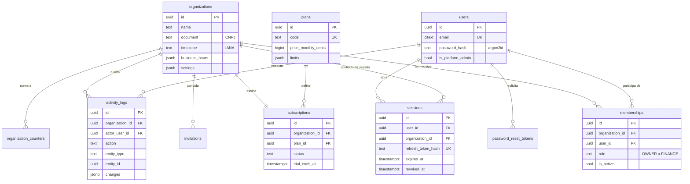
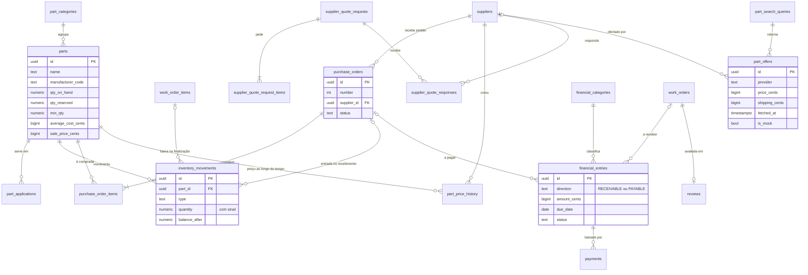

# OficinaOS — Modelo de dados

> Este documento é da **Fase 0**. A fonte de verdade vai ser o schema Drizzle
> e as migrations SQL em `apps/api/src/db/`. O DDL abaixo é um **esboço** que
> fixa as decisões (tipos, chaves, constraints, índices), e não o SQL final.

---

## 1. Convenções

| Tema | Decisão | Por quê |
|---|---|---|
| Banco | PostgreSQL 17 | RLS (isolamento por oficina no próprio banco), `jsonb`, índices parciais, `pg_trgm`, `timestamptz` |
| Chave primária | `uuid` **v7**, gerado na aplicação | É ordenável por tempo, então o B-tree não fragmenta. Não expõe o volume do negócio como um `serial` expõe. Dá para gerar antes do INSERT |
| Número humano | `number int`, **por oficina** (OS nº 182, Orçamento nº 45) | O cliente e o mecânico falam "OS 182", nunca um UUID. Vem de `organization_counters` com `UPDATE … RETURNING`, com lock de linha: sem duplicata sob concorrência |
| Dinheiro | `bigint` em **centavos** (`*_cents`) | Float erra centavo, e é assim que se perde confiança num orçamento |
| Percentual | `integer` em **basis points** (`1250` = 12,50%) | Inteiro, sem arredondamento escondido |
| Quantidade | `numeric(12,3)`, convertido para inteiro em milésimos no domínio | Óleo é vendido em litros (4,5 L), fluido e cabo por metro |
| Data/hora | `timestamptz` (UTC). Vencimento usa `date` | O fuso da oficina fica em `organizations.timezone` (IANA). O Brasil tem 4 fusos |
| Enum | `text` + `CHECK` (não o `ENUM` nativo) | Adicionar um valor não exige `ALTER TYPE` travando a tabela. Os valores moram em `packages/shared` |
| Nomes | `snake_case` no banco, `camelCase` na API | O Drizzle faz o mapeamento |
| Colunas padrão | `organization_id`, `created_at`, `updated_at`, e quando cabe `created_by` e `deleted_at` | |
| Soft delete | Cliente, veículo, peça e serviço usam `deleted_at` | Apagar de verdade quebraria o histórico. **OS e pagamento nunca são apagados, só cancelados** |
| Imutáveis | `inventory_movements`, `activity_logs`, `quote_items` e `quote_approvals` | A role da aplicação só tem `INSERT` e `SELECT` nessas tabelas |
| Normalização | placa → `plate_canonical`; CPF/CNPJ → só dígitos; telefone → E.164 (`+5511987654321`) | Busca e unicidade confiáveis |
| Extensões | `pg_trgm`, `unaccent`, `citext`, `btree_gist` (futuro) | Busca por nome sem acento e com erro de digitação |

### 1.1 Placa: formato antigo e Mercosul

O mesmo carro pode aparecer como `ABC1234` (placa antiga) e, depois da troca,
como `ABC1C34` (Mercosul): o segundo dígito vira letra, 0→A, 1→B, …, 9→J.
Guardamos:

- `plate`: como foi digitada (`ABC-1234`)
- `plate_canonical`: sempre no **formato Mercosul** (`ABC1C34`)

A unicidade e a busca usam `plate_canonical`. Buscar `ABC1234` encontra o carro
cadastrado como `ABC1C34`, e vice-versa. A função mora em `packages/shared/br/plate.ts`.

### 1.2 FK composta de tenant (defesa em profundidade)

Toda tabela-pai tem `UNIQUE (organization_id, id)`. As filhas referenciam o **par**:

```sql
FOREIGN KEY (organization_id, vehicle_id) REFERENCES vehicles (organization_id, id)
```

Assim, **o próprio banco torna impossível** uma OS da oficina A apontar para
um veículo da oficina B, mesmo que um bug na aplicação tente.

---

## 2. Isolamento por oficina (RLS)

```sql
-- Duas roles. A aplicação NUNCA conecta como dona das tabelas nem como superuser.
CREATE ROLE oficinaos_owner LOGIN;                     -- roda migrations, dona das tabelas
CREATE ROLE oficinaos_app   LOGIN NOBYPASSRLS;         -- runtime da API

-- Em cada tabela de tenant (gerado pela migration):
ALTER TABLE customers ENABLE ROW LEVEL SECURITY;
ALTER TABLE customers FORCE  ROW LEVEL SECURITY;
CREATE POLICY tenant_isolation ON customers
  USING      (organization_id = nullif(current_setting('app.org_id', true), '')::uuid)
  WITH CHECK (organization_id = nullif(current_setting('app.org_id', true), '')::uuid);
```

- A API abre **uma transação por operação** e executa
  `select set_config('app.org_id', $1, true)`. O `true` torna o valor **local à
  transação**, o que é compatível com PgBouncer em modo *transaction* e nunca
  vaza para a próxima requisição que pegar a mesma conexão do pool.
- Sem `app.org_id` definido, a policy compara com `NULL` e **não retorna
  linha nenhuma**. Esquecer o contexto falha fechado, nunca aberto.
- Tabelas globais (`users`, `sessions`, `plans`, `password_reset_tokens`) não têm
  RLS de tenant. Só o módulo de auth as acessa.
- **Leitura sem oficina no contexto** (login, seletor de oficina, links públicos)
  usa policies **só de leitura** (`FOR SELECT`) somadas à `tenant_isolation`.
  Elas ampliam o que se lê e nunca o que se escreve: INSERT, UPDATE e DELETE
  continuam presos à oficina do contexto. Em vigor desde a E2 (migration 0003):

| Policy | Tabela | Libera ler | Contexto |
|---|---|---|---|
| `own_memberships` | memberships | os vínculos do próprio usuário, em qualquer oficina | `app.user_id` |
| `member_organizations` | organizations | as oficinas das quais o usuário participa | `app.user_id` |
| `invitation_by_token` | invitations | o convite cujo hash de token foi apresentado | `app.invite_token_hash` |

- A página pública do orçamento (E6) segue o mesmo padrão de **token como
  capacidade**: policy `quote_by_token` lendo `app.quote_token_hash`. Quem
  apresenta o token lê aquele orçamento; o resto do fluxo segue com `app.org_id`.
- **Por que não `SECURITY DEFINER`** (o que a Fase 0 previa): o RLS é `FORCE`,
  vale até para a dona das tabelas, então uma função `SECURITY DEFINER` da dona
  também não enxergaria nada. A alternativa seria uma role com BYPASSRLS, que é
  justamente a porta que o desenho fecha. Os testes `auth-policies.test.ts`
  provam que a leitura ampliada não permite se colocar em outra oficina nem
  alterar o próprio papel.

- **Teste de guarda no CI:** um teste consulta `pg_class`/`pg_policies` e falha se
  existir tabela com coluna `organization_id` sem RLS habilitado e forçado, ou se
  a role da aplicação tiver `BYPASSRLS`/superuser. Ninguém cria uma tabela nova
  "esquecendo" o isolamento.

---

## 3. Tabelas por domínio e fase

| Domínio | Tabelas | Fase |
|---|---|---|
| Plataforma e acesso | `organizations`, `users`, `memberships`, `invitations`, `sessions`, `password_reset_tokens`, `organization_counters`, `idempotency_keys` | MVP 1 |
| Assinatura | `plans`, `subscriptions`, `usage_counters` | MVP 1 (estrutura; cobrança no V3) |
| Clientes e veículos | `customers`, `vehicles`, `odometer_readings` | MVP 1 |
| Agenda | `appointments` | MVP 1 |
| Operação | `work_orders`, `work_order_items`, `work_order_events`, `vehicle_inspections`, `attachments` | MVP 1 |
| Orçamento | `quotes`, `quote_items`, `quote_attachments`, `quote_approvals` | MVP 1 |
| Catálogo e estoque | `services`, `part_categories`, `parts`, `part_applications`, `inventory_movements` | MVP 1 |
| Pagamento (mínimo) | `payments` | MVP 1 |
| Comunicação | `message_templates`, `messages`, `notifications` | MVP 1 |
| Auditoria | `activity_logs` | MVP 1 |
| Fornecedores e compras | `suppliers`, `purchase_orders`, `purchase_order_items`, `supplier_quote_requests`, `supplier_quote_request_items`, `supplier_quote_invites`, `supplier_quote_responses`, `supplier_quote_response_items`, `supplier_quote_awards`, `purchase_receipts`, `purchase_receipt_items`, `purchase_returns`, `purchase_return_items`, `part_price_history` | MVP 2 |
| Pesquisa de peças | `part_search_queries`, `part_offers` | MVP 2 |
| Financeiro ✅ E13 | `financial_categories`, `financial_entries`, `financial_settlements` | MVP 2 |
| Pós-venda e CRM ✅ E16 | `reviews`, `follow_ups`, `leads` | MVP 2 |
| Integrações | `integration_connections`, `webhook_events`, `fiscal_documents`, `payment_intents` | V3 |
| Marketplace | `supplier_directory` (global), `marketplace_orders` | V3+ |

### Como as entidades pedidas foram mapeadas

| Pedido | Onde ficou | Motivo |
|---|---|---|
| `Role`, `Permission` | Constantes em `packages/shared/permissions.ts` + `memberships.role` | Uma permissão só existe se o código a verificar. Uma tabela de permissões sem código correspondente é enfeite. Papéis customizados por oficina (plano Business) viram tabela `custom_roles` no V3, sem mudar os guards |
| `Inventory` | Colunas de saldo em `parts` + `inventory_movements` (livro-razão) | Uma localização por oficina no MVP. Multi-depósito (filiais) vira `stock_locations` depois |
| `VehicleHistory` | Consulta sobre `work_orders` + `work_order_items` + `odometer_readings` | Uma tabela de histórico duplicaria a OS e divergiria dela. `odometer_readings` guarda o que a OS não guarda: a quilometragem ao longo do tempo |
| `AccountReceivable` / `AccountPayable` | Uma tabela `financial_entries` com `direction` (RECEIVABLE / PAYABLE) | Mesmo ciclo de vida (vencimento, valor, baixa, status). O fluxo de caixa sai de uma consulta, sem `UNION`. A UI continua com duas telas |
| `QuoteApproval` | `quote_approvals` | Registro de prova da decisão (quem, quando, IP, o que exatamente foi aprovado) |

---

## 4. ERD

Dividido em três diagramas para continuar legível. Mostra só as colunas-chave;
o detalhe está na seção 5.

### 4.1 Plataforma, acesso e assinatura



### 4.2 Núcleo operacional: cliente → veículo → agenda → OS → orçamento → aprovação

```mermaid
erDiagram
    customers ||--o{ vehicles : "é dono de"
    customers ||--o{ appointments : "agenda"
    vehicles ||--o{ appointments : "é agendado"
    vehicles ||--o{ odometer_readings : "registra km"
    customers ||--o{ work_orders : "contrata"
    vehicles ||--o{ work_orders : "recebe"
    appointments |o--o| work_orders : "vira no check-in"
    work_orders ||--o{ vehicle_inspections : "check-in e check-out"
    work_orders ||--o{ work_order_items : "contém"
    work_orders ||--o{ work_order_events : "timeline"
    work_orders ||--o{ attachments : "fotos"
    services |o--o{ work_order_items : "origem do serviço"
    parts |o--o{ work_order_items : "origem da peça"
    work_orders ||--o{ quotes : "gera versões"
    quotes ||--|{ quote_items : "snapshot imutável"
    work_order_items ||--o{ quote_items : "congelado em"
    quotes ||--o{ quote_attachments : "mostra"
    attachments ||--o{ quote_attachments : "exibida em"
    quotes ||--o| quote_approvals : "decisão do cliente"
    work_orders ||--o{ payments : "recebe"
    customers ||--o{ messages : "conversa"

    customers {
        uuid id PK
        text name
        text document "CPF ou CNPJ"
        text whatsapp "E164"
    }
    vehicles {
        uuid id PK
        uuid customer_id FK
        text plate_canonical "Mercosul"
        text make
        text model
        int odometer_km
    }
    appointments {
        uuid id PK
        uuid vehicle_id FK
        uuid mechanic_user_id FK
        timestamptz starts_at
        timestamptz ends_at
        text status
    }
    work_orders {
        uuid id PK
        int number "por oficina"
        uuid vehicle_id FK
        text status
        text payment_status
        bigint total_cents
        int version "lock otimista"
    }
    work_order_items {
        uuid id PK
        uuid work_order_id FK
        text type "SERVICE ou PART"
        numeric quantity
        bigint unit_price_cents
        text approval_status
        bool is_optional
        text stock_status
    }
    quotes {
        uuid id PK
        int number
        uuid work_order_id FK
        int version
        text status
        text public_token UK
        text content_hash
    }
    quote_items {
        uuid id PK
        uuid quote_id FK
        uuid work_order_item_id FK
        bigint total_cents
    }
    quote_approvals {
        uuid id PK
        uuid quote_id FK
        text decision
        text channel
        inet ip
        text content_hash
    }
    payments {
        uuid id PK
        uuid work_order_id FK
        text method
        bigint amount_cents
        text status
    }
```



### 4.3 Catálogo, estoque, compras, financeiro e pós-venda

Tudo aqui além de catálogo e estoque é **MVP 2**, mas as FKs já foram pensadas.



---

## 5. Esboço das tabelas do MVP 1

Colunas omitidas em todas as tabelas: `created_at timestamptz NOT NULL DEFAULT now()`,
`updated_at timestamptz` e, em toda tabela de tenant,
`organization_id uuid NOT NULL REFERENCES organizations` + `UNIQUE (organization_id, id)`.

### 5.1 Plataforma

```sql
organizations (
  id               uuid PRIMARY KEY,
  name             text NOT NULL,              -- nome fantasia
  legal_name       text,
  document         text,                       -- CNPJ (ou CPF de autônomo), só dígitos
  phone            text, whatsapp text, email citext,
  address          jsonb,                      -- {zip, street, number, complement, district, city, state}
  logo_key         text,                       -- chave no object storage
  timezone         text NOT NULL DEFAULT 'America/Sao_Paulo',
  business_hours   jsonb,                      -- {"mon":[["08:00","12:00"],["13:00","18:00"]], ...}
  settings         jsonb NOT NULL DEFAULT '{}',
    -- validade padrão do orçamento (dias), garantia padrão (dias/km), condições de pagamento,
    -- margem padrão (bps), valor da hora técnica, limite de desconto por papel,
    -- template de checklist, permite estoque negativo
  status           text NOT NULL DEFAULT 'ACTIVE',  -- ACTIVE | SUSPENDED
  onboarding_completed_at timestamptz
)

users (
  id               uuid PRIMARY KEY,
  name             text NOT NULL,
  email            citext NOT NULL UNIQUE,
  password_hash    text NOT NULL,              -- argon2id
  phone            text,
  email_verified_at timestamptz,
  last_login_at    timestamptz,
  is_platform_admin boolean NOT NULL DEFAULT false,   -- backoffice do OficinaOS, não da oficina
  deleted_at       timestamptz
)

memberships (                                   -- usuário ↔ oficina (um usuário pode estar em várias)
  id               uuid PRIMARY KEY,
  organization_id  uuid NOT NULL,
  user_id          uuid NOT NULL REFERENCES users,
  role             text NOT NULL CHECK (role IN ('OWNER','ADMIN','MANAGER','MECHANIC','ATTENDANT','FINANCE')),
  is_active        boolean NOT NULL DEFAULT true,
  calendar_color   text,                       -- cor do mecânico na agenda
  UNIQUE (organization_id, user_id)
)

invitations (
  id uuid PRIMARY KEY, organization_id uuid NOT NULL,
  email citext NOT NULL, role text NOT NULL,
  token_hash text NOT NULL UNIQUE, expires_at timestamptz NOT NULL,
  accepted_at timestamptz, invited_by uuid REFERENCES users
)

sessions (
  id                   uuid PRIMARY KEY,
  user_id              uuid NOT NULL REFERENCES users,
  active_organization_id uuid NOT NULL REFERENCES organizations, -- oficina ativa. Não se chama
                                               -- organization_id: a tabela é global, sem RLS
  refresh_token_hash   text NOT NULL UNIQUE,   -- SHA-256 do token opaco; o token nunca é gravado
  previous_token_hash  text,                   -- detecção de reuso (ver ARCHITECTURE §6)
  rotated_at           timestamptz,
  user_agent text, ip inet,
  last_used_at timestamptz, expires_at timestamptz NOT NULL,
  revoked_at timestamptz, revoked_reason text
)

password_reset_tokens (
  id uuid PRIMARY KEY, user_id uuid NOT NULL REFERENCES users,
  token_hash text NOT NULL UNIQUE, expires_at timestamptz NOT NULL,   -- 30 min
  used_at timestamptz, requested_ip inet
)

organization_counters (
  organization_id uuid, key text,              -- 'work_order' | 'quote' | 'purchase_order'
  value int NOT NULL DEFAULT 0,
  PRIMARY KEY (organization_id, key)
)

idempotency_keys (                             -- aprovação, pagamento, criar OS (duplo toque em 3G)
  scope text, key text,                        -- scope = org_id ou 'public:<quote_id>'
  request_hash text NOT NULL,
  response_status int, response_body jsonb,
  expires_at timestamptz NOT NULL,
  PRIMARY KEY (scope, key)
)
```

### 5.2 Assinatura (estrutura pronta, sem cobrança no MVP 1)

```sql
plans (                                        -- global
  id uuid PRIMARY KEY, code text UNIQUE,       -- STARTER | PROFESSIONAL | BUSINESS
  name text, price_monthly_cents bigint, price_yearly_cents bigint,
  limits   jsonb NOT NULL,                     -- {"max_users":3,"max_work_orders_month":150,"storage_mb":2048}
  features text[] NOT NULL,                    -- {'parts_search','finance','reports_advanced',...}
  is_public boolean NOT NULL DEFAULT true
)

subscriptions (
  id uuid PRIMARY KEY, organization_id uuid NOT NULL UNIQUE,
  plan_id uuid NOT NULL REFERENCES plans,
  status text NOT NULL,                        -- TRIALING | ACTIVE | PAST_DUE | CANCELED | EXPIRED
  trial_ends_at timestamptz,
  current_period_start timestamptz, current_period_end timestamptz,
  cancel_at_period_end boolean NOT NULL DEFAULT false,
  provider text, provider_customer_id text, provider_subscription_id text   -- V3
)

usage_counters (                               -- limite de OS/mês sem COUNT(*) a cada criação
  organization_id uuid, metric text, period text,   -- period = '2026-09'
  value int NOT NULL DEFAULT 0,
  PRIMARY KEY (organization_id, metric, period)
)
```

### 5.3 Clientes e veículos

```sql
customers (
  id uuid PRIMARY KEY, organization_id uuid NOT NULL,
  type          text NOT NULL DEFAULT 'PF',    -- PF | PJ
  name          text NOT NULL,
  document      text,                          -- CPF/CNPJ só dígitos, dígito verificador validado
  phone text, whatsapp text, email citext,
  address       jsonb,
  notes         text,
  source        text,                          -- como conheceu: INDICACAO | GOOGLE | PASSANTE | ...
  marketing_opt_in_at timestamptz,             -- LGPD: consentimento para pós-venda/marketing
  created_by uuid, deleted_at timestamptz
)
-- UNIQUE (organization_id, document) WHERE document IS NOT NULL AND deleted_at IS NULL
-- GIN (immutable_unaccent(name) gin_trgm_ops); btree (organization_id, whatsapp)

vehicles (
  id uuid PRIMARY KEY, organization_id uuid NOT NULL,
  customer_id      uuid NOT NULL,               -- FK composta → customers
  plate            text,                        -- como digitada; NULL = zero km / sem placa
  plate_canonical  text,                        -- formato Mercosul, para busca e unicidade
  make text NOT NULL, model text NOT NULL, version text,
  engine           text,                        -- "2.0 16V": essencial para aplicação de peças
  year_manufacture smallint, year_model smallint,
  fuel             text,                        -- GASOLINA | ETANOL | FLEX | DIESEL | GNV | HIBRIDO | ELETRICO
  transmission     text,                        -- MANUAL | AUTOMATICO | AUTOMATIZADO | CVT
  color text, vin text,
  odometer_km      int,                         -- último km conhecido (cache de odometer_readings)
  odometer_updated_at timestamptz,
  notes text, deleted_at timestamptz
)
-- UNIQUE (organization_id, plate_canonical) WHERE plate_canonical IS NOT NULL AND deleted_at IS NULL

odometer_readings (                            -- base do "última troca de óleo: 8.000 km atrás"
  id uuid PRIMARY KEY, organization_id uuid NOT NULL,
  vehicle_id uuid NOT NULL, km int NOT NULL,
  source text NOT NULL,                        -- CHECK_IN | WORK_ORDER | MANUAL
  work_order_id uuid, recorded_at timestamptz NOT NULL
)
```

A OS guarda `customer_id` **no momento do atendimento**. Se o carro for vendido e
mudar de dono, o histórico antigo continua mostrando quem pagou cada serviço.

### 5.4 Agenda

```sql
appointments (
  id uuid PRIMARY KEY, organization_id uuid NOT NULL,
  customer_id uuid NOT NULL, vehicle_id uuid,   -- veículo pode ser cadastrado no check-in
  mechanic_user_id uuid,                        -- FK composta → memberships (organization_id, user_id)
  service_id uuid, title text NOT NULL,         -- "Troca de embreagem"
  starts_at timestamptz NOT NULL, ends_at timestamptz NOT NULL CHECK (ends_at > starts_at),
  status text NOT NULL DEFAULT 'SCHEDULED',
    -- SCHEDULED | CONFIRMED | IN_PROGRESS | COMPLETED | CANCELED | NO_SHOW
  notes text,
  work_order_id uuid,                           -- preenchido no check-in
  confirmed_at timestamptz, canceled_at timestamptz, cancel_reason text,
  created_by uuid
)
-- btree (organization_id, starts_at); btree (organization_id, mechanic_user_id, starts_at)
```

Conflito de horário é **verificado na aplicação** e devolvido como aviso (a UI pergunta
"confirmar mesmo assim?"). Oficina de verdade encaixa cliente. Uma *exclusion
constraint* com `btree_gist` bloquearia sem escapatória; ela fica disponível se um
dia houver agenda por **box/elevador**, que é recurso físico e não pode ser duplicado.

Como ficou na E8 (migrations `0016`/`0017`):

- a sobreposição é **meio-aberta** (`a.inicio < b.fim && b.inicio < a.fim`), então
  09:00–10:00 e 10:00–11:00 se encostam sem conflitar. A regra mora em
  `packages/shared/calendar.ts` — o banco só aproxima os candidatos pelo índice
  `(organization_id, mechanic_user_id, starts_at)`;
- `COMPLETED`, `CANCELED` e `NO_SHOW` **devolvem o horário** para a agenda;
- a FK do mecânico é composta com **`memberships (organization_id, user_id)`**:
  mecânico de outra oficina não entra nem por engano;
- a ligação com a OS existe nos dois sentidos. `work_orders.appointment_id` ganha
  a FK composta na migration `0017`, e não no schema do Drizzle, porque
  `appointments.ts` e `work-orders.ts` passariam a se importar em círculo;
- cancelar exige motivo, e isso é `CHECK` no banco, não só validação de tela.

### 5.5 Ordem de serviço

```sql
work_orders (
  id uuid PRIMARY KEY, organization_id uuid NOT NULL,
  number          int NOT NULL,                 -- UNIQUE (organization_id, number)
  customer_id uuid NOT NULL, vehicle_id uuid NOT NULL, appointment_id uuid,
  status          text NOT NULL DEFAULT 'OPEN',
    -- OPEN | DIAGNOSING | AWAITING_QUOTE | AWAITING_APPROVAL | APPROVED
    -- | IN_PROGRESS | WAITING_PARTS | COMPLETED | DELIVERED | CANCELED
  payment_status  text NOT NULL DEFAULT 'UNPAID',   -- UNPAID | PARTIAL | PAID (independente do status)
  odometer_km     int,
  complaint       text,                         -- relato do cliente: "barulho ao frear"
  diagnosis       text,                         -- diagnóstico técnico
  customer_notes  text,                         -- aparece no orçamento e na OS impressa
  internal_notes  text,                         -- só a equipe vê
  advisor_user_id  uuid,                        -- atendente/consultor responsável
  mechanic_user_id uuid,                        -- mecânico principal
  -- totais: cache recalculado pelo domínio a cada mudança de item (fonte: packages/shared/pricing)
  parts_subtotal_cents    bigint NOT NULL DEFAULT 0,
  services_subtotal_cents bigint NOT NULL DEFAULT 0,
  discount_mode   text,                          -- AMOUNT | PERCENT
  discount_value  bigint NOT NULL DEFAULT 0,     -- centavos ou bps, conforme o modo
  discount_cents  bigint NOT NULL DEFAULT 0,
  surcharge_cents bigint NOT NULL DEFAULT 0,
  total_cents     bigint NOT NULL DEFAULT 0,
  approved_total_cents bigint NOT NULL DEFAULT 0,
  paid_cents      bigint NOT NULL DEFAULT 0,
  promised_at     timestamptz,                   -- previsão de entrega → alerta "veículo atrasado"
  warranty_days   int, warranty_km int,          -- padrão da oficina; CDC art. 26: mínimo de 90 dias
  opened_at timestamptz NOT NULL, approved_at timestamptz, started_at timestamptz,
  completed_at timestamptz, delivered_at timestamptz,
  canceled_at timestamptz, cancel_reason text,
  version         int NOT NULL DEFAULT 1,        -- lock otimista: atendente e mecânico editando juntos
  created_by uuid
)
-- btree (organization_id, status, opened_at DESC)
-- btree (organization_id, vehicle_id, opened_at DESC); btree (organization_id, customer_id, opened_at DESC)

work_order_items (
  id uuid PRIMARY KEY, organization_id uuid NOT NULL,
  work_order_id    uuid NOT NULL,
  type             text NOT NULL,               -- SERVICE | PART
  service_id uuid, part_id uuid,                -- NULL = item avulso (peça comprada fora, serviço sem cadastro)
  description      text NOT NULL,               -- snapshot do nome no momento
  part_code text, brand text,                   -- snapshot
  quantity         numeric(12,3) NOT NULL DEFAULT 1 CHECK (quantity > 0),
  unit_price_cents bigint NOT NULL CHECK (unit_price_cents >= 0),
  unit_cost_cents  bigint,                      -- custo, para a margem; oculto sem 'parts:view_cost'
  discount_cents   bigint NOT NULL DEFAULT 0,
  total_cents      bigint NOT NULL,
  is_optional      boolean NOT NULL DEFAULT false,   -- "recomendado": o cliente pode desmarcar
  approval_status  text NOT NULL DEFAULT 'DRAFT',    -- DRAFT | PENDING | APPROVED | REJECTED
  sourcing         text NOT NULL DEFAULT 'STOCK',    -- STOCK | TO_ORDER | CUSTOMER_PROVIDED (peça do cliente)
  stock_status     text NOT NULL DEFAULT 'NONE',     -- NONE | RESERVED | PARTIAL | CONSUMED | RELEASED
  reserved_qty     numeric(12,3) NOT NULL DEFAULT 0,
  mechanic_user_id uuid,                        -- quem executou o serviço (produtividade)
  estimated_minutes int, actual_minutes int,    -- actual_minutes: MVP 2
  position         int NOT NULL
)

work_order_events (                            -- timeline da OS, voltada a pessoas (a auditoria é outra)
  id uuid PRIMARY KEY, organization_id uuid NOT NULL,
  work_order_id uuid NOT NULL,
  type text NOT NULL,     -- STATUS_CHANGED | NOTE | QUOTE_SENT | QUOTE_VIEWED | QUOTE_APPROVED | QUOTE_REJECTED
                          -- | CUSTOMER_QUESTION | PHOTO_ADDED | CHECK_IN | PAYMENT | DELIVERED ...
  data jsonb NOT NULL DEFAULT '{}',
  actor_type text NOT NULL,                     -- USER | CUSTOMER | SYSTEM
  actor_user_id uuid
)
-- btree (organization_id, work_order_id, created_at)

vehicle_inspections (                          -- check-in / check-out
  id uuid PRIMARY KEY, organization_id uuid NOT NULL,
  work_order_id uuid NOT NULL, vehicle_id uuid NOT NULL,
  type          text NOT NULL,                  -- CHECK_IN | CHECK_OUT
  odometer_km   int,
  fuel_level    smallint CHECK (fuel_level BETWEEN 0 AND 8),   -- oitavos, como o ponteiro do painel
  checklist     jsonb NOT NULL,   -- [{"key":"front_scratches","label":"Riscos dianteiros","state":"OK|ISSUE|NA","note":""}]
  damages       jsonb NOT NULL DEFAULT '[]',    -- [{"zone":"front_left_door","kind":"SCRATCH|DENT|BROKEN","note":"","attachment_id":"…"}]
  accessories   jsonb NOT NULL DEFAULT '[]',    -- ["estepe","macaco","chave de roda","tapetes","som"]
  notes text,
  customer_acknowledged_at timestamptz, signature_attachment_id uuid,   -- assinatura na tela: MVP 2
  performed_by uuid, performed_at timestamptz NOT NULL
)

attachments (
  id uuid PRIMARY KEY, organization_id uuid NOT NULL,
  -- FKs explícitas em vez de polimórfica (entity_type/entity_id): o banco garante a integridade
  work_order_id uuid, work_order_item_id uuid, inspection_id uuid, vehicle_id uuid,
  kind          text NOT NULL,                  -- PHOTO | VIDEO | DOCUMENT
  storage_key   text NOT NULL, file_name text, mime_type text NOT NULL,
  size_bytes    bigint NOT NULL, width int, height int,
  caption       text,
  visible_to_customer boolean NOT NULL DEFAULT false,
  status        text NOT NULL DEFAULT 'PENDING_UPLOAD',   -- PENDING_UPLOAD | READY
  uploaded_by uuid, deleted_at timestamptz
)
```

O checklist e as avarias são `jsonb` de propósito: o modelo de checklist varia por
oficina, é sempre lido e gravado inteiro e nunca é filtrado item a item. Uma tabela
de itens traria joins sem ganho nenhum.

### 5.6 Orçamento: o diferencial

```sql
quotes (
  id uuid PRIMARY KEY, organization_id uuid NOT NULL,
  number        int NOT NULL,                   -- UNIQUE (organization_id, number)
  work_order_id uuid NOT NULL,
  version       int NOT NULL,                   -- 1, 2, 3… por OS
  kind          text NOT NULL DEFAULT 'INITIAL',    -- INITIAL | SUPPLEMENTARY (achou mais coisa na execução)
  status        text NOT NULL,
    -- SENT | APPROVED | PARTIALLY_APPROVED | REJECTED | EXPIRED | SUPERSEDED | REVOKED
  public_token  text NOT NULL UNIQUE,           -- 32 bytes aleatórios, base64url (~43 caracteres)
  valid_until   timestamptz NOT NULL,
  snapshot      jsonb NOT NULL,   -- congelado no envio: dados da oficina, cliente, veículo, condições,
                                  -- garantia, observações. O que o cliente viu não muda depois.
  content_hash  text NOT NULL,    -- SHA-256 do snapshot canônico + itens
  subtotal_cents bigint NOT NULL, discount_cents bigint NOT NULL,
  surcharge_cents bigint NOT NULL, total_cents bigint NOT NULL,
  sent_at timestamptz NOT NULL, sent_by uuid NOT NULL, sent_channel text,   -- WHATSAPP_LINK | COPY_LINK | PRINT
  first_viewed_at timestamptz, last_viewed_at timestamptz, view_count int NOT NULL DEFAULT 0,
  decided_at timestamptz,
  superseded_by_quote_id uuid
)

quote_items (                                  -- imutável
  id uuid PRIMARY KEY, organization_id uuid NOT NULL,
  quote_id uuid NOT NULL,
  work_order_item_id uuid,                     -- ponteiro, não a verdade: `on delete set null (work_order_item_id)`
                                               -- quando o item sai da OS. A cópia congelada abaixo continua inteira
  type text NOT NULL, description text NOT NULL, part_code text, brand text,
  quantity numeric(12,3) NOT NULL, unit_price_cents bigint NOT NULL,
  discount_cents bigint NOT NULL, total_cents bigint NOT NULL,
  is_optional boolean NOT NULL, position int NOT NULL
)

quote_attachments (                            -- quais fotos o cliente vê, e junto de qual item
  quote_id uuid, attachment_id uuid, organization_id uuid NOT NULL,
  quote_item_id uuid,                           -- "Identificamos este problema no seu veículo" ao lado do item
  caption text, position int,
  PRIMARY KEY (quote_id, attachment_id)
)

quote_approvals (                              -- registro de prova; imutável; UMA decisão por orçamento
  id uuid PRIMARY KEY, organization_id uuid NOT NULL,
  quote_id uuid NOT NULL UNIQUE,
  decision        text NOT NULL,                -- APPROVED | PARTIALLY_APPROVED | REJECTED
  channel         text NOT NULL,                -- PUBLIC_LINK | PHONE | IN_PERSON | WHATSAPP
  approved_quote_item_ids uuid[] NOT NULL DEFAULT '{}',
  approved_total_cents bigint NOT NULL DEFAULT 0,
  signer_name     text,                         -- nome digitado pelo cliente na confirmação
  rejection_reason text,
  ip inet, user_agent text,                     -- só no canal PUBLIC_LINK
  content_hash    text NOT NULL,                -- igual ao do quote: prova de que aprovou ESTA versão
  recorded_by_user_id uuid                      -- aprovação por telefone/presencial registrada pela equipe
)
```

**Por que o orçamento é um snapshot separado da OS.** A OS é viva: o mecânico acha
mais um problema, a peça muda de preço. O orçamento é o que o cliente **viu e
aprovou**, e isso não pode mudar depois. O fluxo:

1. Itens nascem na OS como `DRAFT`.
2. **Enviar orçamento** congela os itens `DRAFT` em `quote_items`. Eles passam a `PENDING`.
3. O cliente decide. Os itens viram `APPROVED` ou `REJECTED`, e o orçamento guarda a prova.
4. Achou mais coisa na execução? Os itens novos entram como `DRAFT` e viram um
   **orçamento complementar** (`kind = SUPPLEMENTARY`) só com eles.
5. Editou um item `PENDING` antes da resposta? O orçamento vira `SUPERSEDED`, e o
   link antigo leva automaticamente à versão nova. O cliente só precisa de um link.

### 5.7 Catálogo e estoque

```sql
services (
  id uuid PRIMARY KEY, organization_id uuid NOT NULL,
  name text NOT NULL, category text, description text,
  pricing_mode       text NOT NULL DEFAULT 'FIXED',   -- FIXED | HOURLY (hora técnica × tempo padrão)
  default_price_cents bigint,
  estimated_minutes  int,
  interval_km int, interval_months int,         -- troca de óleo: 10.000 km / 12 meses → próxima manutenção
  is_active boolean NOT NULL DEFAULT true, deleted_at timestamptz
)

part_categories (                              -- as 11 do briefing, semeadas ao criar a oficina
  id uuid PRIMARY KEY, organization_id uuid NOT NULL,
  name text NOT NULL, position int
)

parts (
  id uuid PRIMARY KEY, organization_id uuid NOT NULL,
  name text NOT NULL,
  sku text,                                     -- código interno da oficina
  manufacturer_code text,                       -- código do fabricante (ex.: N-1234)
  manufacturer text,                            -- marca: Bosch, Cofap, Nakata…
  category_id uuid, description text,
  unit text NOT NULL DEFAULT 'UN',              -- UN | L | KG | M | JG | KIT
  ean text, ncm text,                           -- fiscal (V3)
  last_cost_cents bigint, average_cost_cents bigint, sale_price_cents bigint,
  markup_bps int,                               -- NULL = usa a margem padrão da oficina
  track_stock boolean NOT NULL DEFAULT true,
  qty_on_hand  numeric(12,3) NOT NULL DEFAULT 0,  -- cache do livro-razão, atualizado na mesma transação
  qty_reserved numeric(12,3) NOT NULL DEFAULT 0,
  min_qty      numeric(12,3) NOT NULL DEFAULT 0,
  location text,                                -- "Prateleira B3"
  preferred_supplier_id uuid,                   -- E10: FK composta → suppliers; limpo quando o fornecedor sai da lista
  is_active boolean NOT NULL DEFAULT true, deleted_at timestamptz
)
-- GIN trigram em name e manufacturer_code; parcial (organization_id) WHERE qty_on_hand - qty_reserved < min_qty

part_applications (
  id uuid PRIMARY KEY, organization_id uuid NOT NULL,
  part_id uuid NOT NULL,
  make text NOT NULL, model text, engine text,
  year_from smallint, year_to smallint, notes text
)

inventory_movements (                          -- livro-razão imutável; o saldo é derivável daqui
  id uuid PRIMARY KEY, organization_id uuid NOT NULL,
  part_id uuid NOT NULL,
  type text NOT NULL,
    -- INITIAL | MANUAL_IN | PURCHASE_IN | WORK_ORDER_OUT | ADJUSTMENT | CUSTOMER_RETURN | SUPPLIER_RETURN
  quantity numeric(12,3) NOT NULL,              -- com sinal: + entra, − sai
  unit_cost_cents bigint,
  balance_after numeric(12,3) NOT NULL,
  average_cost_after_cents bigint,
  work_order_id uuid, work_order_item_id uuid, purchase_order_id uuid,
  reason text, created_by uuid
)
```

A **reserva não é movimento**. Ela vive em `work_order_items.reserved_qty` e em
`parts.qty_reserved`. Disponível = `qty_on_hand − qty_reserved`. As regras de reserva
e baixa estão em ARCHITECTURE §10.

### 5.8 Pagamento, comunicação e auditoria

```sql
payments (                                     -- MVP 1: registro manual na entrega
  id uuid PRIMARY KEY, organization_id uuid NOT NULL,
  work_order_id uuid, customer_id uuid NOT NULL,
  financial_entry_id uuid,                      -- MVP 2
  method text NOT NULL,     -- PIX | CASH | DEBIT_CARD | CREDIT_CARD | BOLETO | BANK_TRANSFER | OTHER
  amount_cents bigint NOT NULL CHECK (amount_cents > 0),
  installments smallint NOT NULL DEFAULT 1,
  status text NOT NULL DEFAULT 'CONFIRMED',     -- CONFIRMED | CANCELED (V3: PENDING | FAILED | REFUNDED)
  paid_at timestamptz NOT NULL,
  provider text, provider_payment_id text,      -- V3: gateway
  notes text,
  canceled_at timestamptz, canceled_by uuid, cancel_reason text,
  created_by uuid NOT NULL
)

message_templates (                            -- os padrões ficam no código; aqui só o que a oficina alterou
  id uuid PRIMARY KEY, organization_id uuid NOT NULL,
  key text NOT NULL,     -- QUOTE_SENT | APPOINTMENT_CONFIRMATION | VEHICLE_READY | POST_SALE | REVIEW_REQUEST | MAINTENANCE_DUE
  channel text NOT NULL DEFAULT 'WHATSAPP',
  body text NOT NULL,    -- "Olá, {cliente}. Preparamos o orçamento do seu {veiculo}…"
  is_active boolean NOT NULL DEFAULT true,
  UNIQUE (organization_id, key, channel)
)

messages (                                     -- histórico de comunicação com o cliente
  id uuid PRIMARY KEY, organization_id uuid NOT NULL,
  customer_id uuid, channel text NOT NULL,     -- WHATSAPP_LINK | WHATSAPP_API | EMAIL | PUBLIC_PAGE
  direction text NOT NULL,                     -- OUTBOUND | INBOUND
  template_key text, body text NOT NULL, to_address text,
  work_order_id uuid, quote_id uuid, appointment_id uuid,
  status text NOT NULL,    -- LINK_OPENED (V1: não há confirmação de entrega) | SENT | DELIVERED | READ | FAILED | RECEIVED
  sent_by uuid
)

notifications (                                -- in-app; uma linha por destinatário (fan-out na criação)
  id uuid PRIMARY KEY, organization_id uuid NOT NULL,
  user_id uuid NOT NULL,
  type text NOT NULL,      -- QUOTE_APPROVED | QUOTE_REJECTED | QUOTE_QUESTION | QUOTE_VIEWED | ...
  title text NOT NULL, body text, link text,
  work_order_id uuid, quote_id uuid,
  read_at timestamptz
)
-- btree (organization_id, user_id, read_at, created_at DESC)

activity_logs (                                -- auditoria: append-only (sem UPDATE/DELETE para a role app)
  id uuid PRIMARY KEY, organization_id uuid NOT NULL,
  actor_type text NOT NULL,                    -- USER | CUSTOMER | SYSTEM
  actor_user_id uuid,
  action text NOT NULL,     -- 'work_order.created' | 'work_order_item.price_changed' | 'payment.canceled' | ...
  entity_type text NOT NULL, entity_id uuid NOT NULL,
  work_order_id uuid,                          -- atalho para "tudo que aconteceu nesta OS"
  changes jsonb,            -- {"unit_price_cents": {"from": 18990, "to": 15000}}
  metadata jsonb, ip inet, user_agent text
)
-- btree (organization_id, created_at DESC); btree (organization_id, entity_type, entity_id, created_at DESC)
-- particionamento mensal quando o volume justificar
```

**Timeline × auditoria.** `work_order_events` é para a equipe acompanhar a OS
("Cliente visualizou o orçamento há 2 h"). `activity_logs` é a trilha de auditoria
completa e técnica ("João alterou o preço do item de R$ 189,90 para R$ 150,00").
As duas são gravadas pela mesma chamada de serviço, na mesma transação.

---

## 6. Esboço do MVP 2 (para garantir que o MVP 1 não feche portas)

```text
suppliers                     ✅ E10 (migrations 0018/0019): id, name, legal_name, document (CNPJ), contact_name,
                              phone, whatsapp, email, address, categories text[] (GIN), rating smallint (1–5),
                              lead_time_days, notes, deleted_at. UNIQUE (organization_id, document) só entre
                              os ativos. directory_supplier_id fica para o V3 (marketplace)
purchase_orders               ✅ E12 (migrations 0024–0026): id, number, supplier_id, status (DRAFT|ORDERED|PARTIAL|
                              RECEIVED|CANCELED), supplier_quote_request_id, expected_on date, shipping_cents,
                              notes, ordered_at/by, received_at, closed_short_at + close_reason, canceled_at/by +
                              cancel_reason, created_by, version. CHECKs: fora do rascunho tem ordered_at;
                              cancelado ⇔ canceled_at, com motivo. A OS de cada peça fica na linha
purchase_order_items          ✅ E12: id, purchase_order_id, part_id (obrigatório: estoque e custo são da peça),
                              work_order_item_id, supplier_quote_award_id, description, part_code, quantity,
                              unit_cost_cents, received_quantity, returned_quantity, position. CHECKs: devolvido ≤
                              recebido e (recebido − devolvido) ≤ pedido
purchase_receipts             ✅ E12, append-only: id, purchase_order_id, client_request_id (UNIQUE por oficina),
                              invoice_number, shipping_cents, notes, received_by, received_at
purchase_receipt_items        ✅ E12, append-only: receipt_id, purchase_order_item_id, quantity, unit_cost_cents (nota),
                              freight_cents (rateio), landed_unit_cost_cents, inventory_movement_id
purchase_returns              ✅ E12, append-only: id, purchase_order_id, client_request_id (UNIQUE), reason, returned_by/at
purchase_return_items         ✅ E12, append-only: return_id, purchase_order_item_id, quantity, unit_cost_cents,
                              inventory_movement_id
supplier_quote_requests       ✅ E11 (migrations 0020–0023): id, number, status (OPEN|CLOSED|CANCELED; vencida é
                              calculada), work_order_id, vehicle jsonb (marca, modelo, versão, ano, motor, chassi),
                              include_vin, message, content_hash, expires_at, closed_at, canceled_at, cancel_reason.
                              CHECK: o jsonb nunca tem `plate`; chassi só com include_vin
supplier_quote_request_items  ✅ E11: id, request_id, work_order_item_id, part_id, description, part_code, brand,
                              quantity, unit, position — cópia do item da OS no momento do pedido
supplier_quote_invites        ✅ E11: id, request_id, supplier_id, token_hash (sha256, único; o link em texto não é
                              guardado), link_issued_at, first/last_viewed_at, view_count. UNIQUE (request, supplier).
                              Policy `supplier_invite_by_token`: sem oficina no contexto, o hash lê só o próprio convite
supplier_quote_responses      ✅ E11, append-only: id, invite_id, version (UNIQUE por convite), responder_name,
                              shipping_cents, notes, content_hash, ip, user_agent — cada envio é uma versão; vale a última
supplier_quote_response_items ✅ E11, append-only: id, response_id, request_item_id, availability
                              (AVAILABLE|TO_ORDER|UNAVAILABLE), unit_price_cents (CHECK: obrigatório e > 0 sem ser
                              UNAVAILABLE; proibido com UNAVAILABLE), brand, lead_time_days, notes
supplier_quote_awards         ✅ E11: id, request_item_id (UNIQUE: uma escolha por peça), response_item_id,
                              awarded_by, awarded_at
part_price_history            ✅ E11, append-only: id, part_id, supplier_id, price_cents (> 0), source
                              (PURCHASE|RFQ|PRICE_LIST|PROVIDER), supplier_quote_request_id, purchase_order_id (E12),
                              captured_at. CHECK: PURCHASE aponta a compra e RFQ a cotação
supplier_price_list_items     ✅ E14 (migrations 0030/0031): id, supplier_id, code, name, brand, price_cents, unit,
                              import_batch. UNIQUE (org, supplier, lower(code)) entre as que têm código: é por ele que
                              a importação seguinte atualiza o preço. GIN trigram no nome
part_search_queries           ✅ E14: id, query, vehicle_id, providers text[], requested_by, created_at
part_offers                   ✅ E14, append-only: id, query_id, provider (internal|price_list|rfq|mock), is_mock,
                              supplier_id, part_id, title, brand, code, price_cents, shipping_cents, availability,
                              lead_time_days, available_quantity, offer_url, raw jsonb, fetched_at, position.
                              A oferta é o que o provider respondeu NAQUELE instante: mudou o preço, é outra busca
financial_categories          ✅ E13 (migrations 0027/0028): id, direction, name, system_key (SERVICES, OTHER_INCOME,
                              PARTS, PAYROLL, RENT, UTILITIES, TAXES, TOOLS, OTHER_EXPENSE). As nove nascem com a
                              oficina; renomear pode, apagar não. UNIQUE (org, direction, lower(name))
financial_entries             ✅ E13: id, direction, status (OPEN|PARTIAL|PAID|CANCELED — vencida é CALCULADA, D31),
                              origin (MANUAL|WORK_ORDER|PURCHASE), category_id, description, amount_cents,
                              paid_cents (cache das baixas), due_date, customer_id, supplier_id, work_order_id,
                              purchase_order_id, group_id + installment_number/count, settled_at, canceled_at/by +
                              reason, version. CHECKs: pago entre 0 e o valor; automático aponta o documento;
                              cancelado <=> canceled_at com motivo
financial_settlements         ✅ E13: id, entry_id, client_request_id (UNIQUE por oficina), amount_cents, method,
                              paid_at, status (CONFIRMED|CANCELED), payment_id, canceled_at/by + reason. A baixa de
                              uma conta de OS NÃO mora aqui: é o `payments` da E7 (D30)
work_orders.tracking_token    ✅ E17 (migrations 0036/0037): o link "acompanhe seu veículo". Nasce só quando a
                              oficina manda o link; policy `work_order_by_tracking_token` libera ler AQUELA OS
work_order_item_timers        ✅ E15 (migrations 0032/0033): id, work_order_id, work_order_item_id, mechanic_user_id,
                              started_at, stopped_at, minutes, notes. Índice único parcial (org, mecânico) entre as
                              voltas ABERTAS: uma por pessoa. Cada volta é uma linha; o tempo do item é a soma
reviews                       ✅ E16 (migrations 0034/0035): id, work_order_id (UNIQUE: uma nota por OS), customer_id,
                              token_hash (sha256; o token em texto não é guardado), rating 1..5, comment,
                              submitted_at, invited_at, first_viewed_at, ip, user_agent, google_invited.
                              Policy `review_by_token`: sem oficina no contexto, o hash lê só a própria linha
follow_ups                    ✅ E16: id, type (POST_SALE_7D|MAINTENANCE_DUE|NO_RETURN_6M), status
                              (PENDING|DONE|SKIPPED), customer_id, vehicle_id, work_order_id, due_on date, reason,
                              dedupe_key (UNIQUE por oficina), done_at/by, outcome. A fila é recalculada a cada
                              abertura da tela; a dedupe_key é o que impede a mesma conversa de nascer duas vezes
leads                         ✅ E16: id, name, phone, stage (NEW|CONTACTED|QUOTED|WAITING|WON|LOST), source,
                              vehicle_desc, need, estimated_value_cents, notes, lost_reason, customer_id,
                              work_order_id, closed_at. CHECK: perdido sempre tem motivo
```

### Nota fiscal de serviço (V3, E18, migrations 0041/0042)

```
organization_fiscal_settings  1:1 com a oficina: inscrição municipal e estadual, regime (MEI|SIMPLES_NACIONAL|
                              LUCRO_PRESUMIDO|LUCRO_REAL), cnae, item da lista LC 116, código municipal do
                              serviço, iss_rate_bps (0..10000), iss_retained_default, rps_series, environment
                              (SIMULATOR|HOMOLOGATION|PRODUCTION), provider, provider_company_id,
                              additional_information. **Sem certificado e sem senha**: quem assina é o
                              emissor, e o que guardamos é só o id da empresa lá (D38)
invoices                      id, kind (NFSE), status (DRAFT|QUEUED|AUTHORIZED|REJECTED|CANCELED), environment,
                              provider, work_order_id, customer_id, vehicle_id, rps_number + rps_series
                              (UNIQUE por oficina; a numeração do RPS é NOSSA), invoice_number e
                              verification_code (da prefeitura), provider_ref, public/pdf/xml_url,
                              client_request_id (UNIQUE por oficina: o mesmo POST não emite duas — D32),
                              service/deductions/discount/base/iss/irrf/pis/cofins/csll/inss/total/net em
                              centavos, iss_rate_bps, iss_retained, description (a discriminação que o cliente
                              lê), provider_response jsonb (a resposta inteira do emissor: é ela que explica
                              uma rejeição), issued_at, canceled_at/by/reason, rejection_reason.
                              CHECK: cancelada sempre tem data E motivo; autorizada sempre tem issued_at
invoice_items                 cópia congelada dos SERVIÇOS que entraram na nota (descrição, quantidade, preço,
                              total, posição). `work_order_item_id` é ponteiro, não verdade:
                              `on delete set null (work_order_item_id)`, como em quote_items (D36)
```

`part_offers.is_mock` é coluna **e** aparece na interface. Oferta de provider de
desenvolvimento nunca pode ser confundida com preço real.

---

## 7. Índices e concorrência: resumo

| Situação | Estratégia |
|---|---|
| Número da OS/orçamento | `UPDATE organization_counters SET value = value + 1 … RETURNING value` na transação da criação |
| Baixa e reserva de estoque | `SELECT … FROM parts WHERE id = ANY($1) ORDER BY id FOR UPDATE` (ordem fixa evita deadlock) |
| Aprovação dupla (dois toques, duas abas) | `SELECT … FROM quotes WHERE id = $1 FOR UPDATE` + `UNIQUE (quote_id)` em `quote_approvals` + `Idempotency-Key` |
| OS editada por duas pessoas | `work_orders.version`: o `PATCH` envia a versão e recebe 409 se estiver velha |
| Busca por placa | btree `(organization_id, plate_canonical)` + prefixo |
| Busca por nome/telefone | GIN trigram sobre `immutable_unaccent(name)`; btree em `whatsapp`/`phone` |
| Listas da OS | btree `(organization_id, status, opened_at DESC)` |
| Dashboard | agregações por `(organization_id, completed_at)` e `(organization_id, paid_at)`. **O cache de 60 s não entrou no MVP 1** (E9): em oficina pequena a consulta é barata, e número velho logo depois de registrar um pagamento parece defeito — entra quando houver volume |
| Crescimento (`activity_logs`, `inventory_movements`, `messages`) | índice começando por `organization_id`; particionamento por mês quando passar de dezenas de milhões |

---

## 8. Seeds

| Seed | Conteúdo | Quando roda |
|---|---|---|
| `plans` | STARTER, PROFESSIONAL, BUSINESS com limites e recursos | Toda instalação |
| `defaults` (por oficina) | 11 categorias de peça, template de checklist, templates de mensagem | Ao criar uma oficina |
| `demo` | 1 oficina fictícia, 6 usuários (um por papel), 10 clientes, 15 veículos, 20 OS em todos os status, orçamentos (aprovados, recusados, pendentes), 10 peças, 12 serviços, 10 agendamentos, pagamentos, movimentos de estoque; **5 fornecedores ligados às peças (E10)**; contas a pagar e a receber, despesas do mês, cronômetro nos serviços executados, avaliações, funil, **uma cotação respondida por dois fornecedores que virou pedido recebido (E11→E12→E13)** e listas de preço importadas | Só em dev/demo, com dados obviamente fictícios: "Oficina Demonstração", CPFs gerados válidos mas marcados, telefones `+55 11 90000-00xx` |
